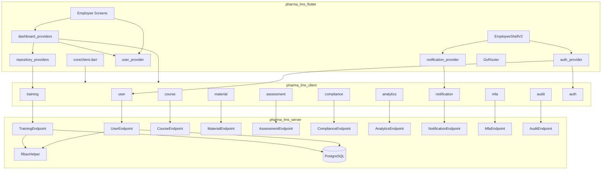
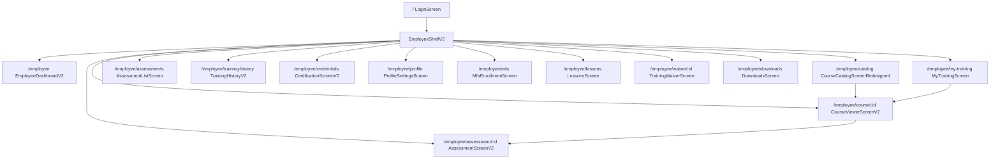
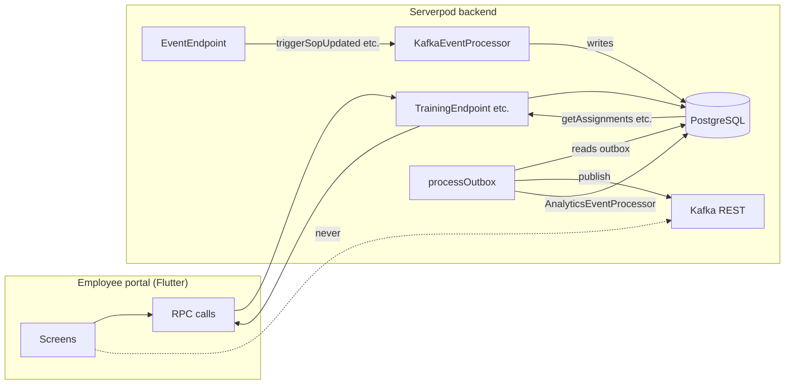

# Employee Portal — Full System Design & Architecture

This document describes the **complete system design and architecture** behind the **entire employee portal** as implemented in the app: all layers, files, classes, providers, client API methods, server endpoints, RBAC, auth, routing, and design system in use. For screen-level detail (every button, read/write) see [EMPLOYEE_PORTAL_README.md](./EMPLOYEE_PORTAL_README.md).

---

## Table of contents

1. [Purpose & scope](#1-purpose--scope)
2. [Full architecture](#2-full-architecture)
3. [Technology stack (actual)](#3-technology-stack-actual)
4. [Flutter app structure](#4-flutter-app-structure)
5. [Client & server connection](#5-client--server-connection)
6. [Authentication & role flow](#6-authentication--role-flow)
7. [Routing](#7-routing)
8. [State layer — providers & repositories](#8-state-layer--providers--repositories)
9. [API surface — client methods used](#9-api-surface--client-methods-used)
10. [Backend — endpoints & RBAC](#10-backend--endpoints--rbac)
11. [Presentation — shell & screens](#11-presentation--shell--screens)
12. [Design system in use](#12-design-system-in-use)
13. [Data flow across the entire employee portal](#13-data-flow-across-the-entire-employee-portal)
14. [Design decisions](#14-design-decisions)
15. [Security & compliance](#15-security--compliance)
16. [Performance & reliability](#16-performance--reliability)
17. [Diagrams](#17-diagrams)
18. [Related documentation](#18-related-documentation)
19. [Kafka and the employee portal](#19-kafka-and-the-employee-portal)

---

## 1. Purpose & scope

The **employee portal** is the learner-facing UI of Pharma LMS. It allows employees to:

- View **dashboard** (compliance, assignments, expiring certs, recent activity, charts).
- Browse **course catalog** and **self-enroll**.
- **Take courses** (viewer: modules, lessons, materials, progress, engagement).
- **Take assessments** and complete training (e-signature, certificate).
- View **training history**, **credentials**, **downloads**.
- Manage **profile**, **MFA**, **waivers** (view).

**Out of scope:** Login is shared; admin, trainer, QA, auditor portals are separate.

---

## 2. Full architecture

End-to-end stack as implemented:

```
┌─────────────────────────────────────────────────────────────────────────────────────┐
│  Flutter app (pharma_lms_flutter)                                                    │
│  ├── lib/core/client.dart           → late Client client; initClient(serverUrl)      │
│  ├── lib/providers/                 → Riverpod providers (see §8)                   │
│  ├── lib/repositories/              → TrainingRepository (wraps client.training)     │
│  ├── lib/features/                  → Auth, employee_dashboard, my_learning,         │
│  │                                    course_catalog, course_viewer, assessment,   │
│  │                                    training_history, credentials, profile,       │
│  │                                    waiver, downloads + auth (login, mfa)         │
│  ├── lib/layout/employee_shell_v2.dart  → EmployeeShellV2 (sidebar, header, child)  │
│  ├── lib/routes/app_router.dart     → GoRouter, ShellRoute(EmployeeShellV2), routes  │
│  └── lib/design_system/             → tokens, components, pharma_design_system      │
└─────────────────────────────────────────────────────────────────────────────────────┘
                                        │
                        Serverpod RPC (HTTPS) │ pharma_lms_client
                                        ▼
┌─────────────────────────────────────────────────────────────────────────────────────┐
│  Serverpod backend (pharma_lms_server)                                               │
│  ├── lib/src/endpoints/                                                              │
│  │     user_endpoint.dart         → getUserByEmail, getUserRoleByEmail               │
│  │     training_endpoint.dart     → getEnrollmentsForUser, selfEnroll, completeTraining, …│
│  │     course_endpoint.dart       → listCourses, getCourseVersions, getModules…       │
│  │     material_endpoint.dart     → getProgress, updateProgress, recordEngagement…   │
│  │     assessment_endpoint.dart   → getAssessmentForCourse, startAttempt, submit…   │
│  │     compliance_endpoint.dart  → getUserCompliance, getDepartmentCompliance        │
│  │     analytics_endpoint.dart    → getMonthlyTrainingHours, getComplianceAlerts…   │
│  │     notification_endpoint.dart→ getInAppNotifications, markNotificationRead      │
│  │     mfa_endpoint.dart          → getMfaStatus, enrollMfa, verifyMfa, disableMfa   │
│  │     audit_endpoint.dart         → logReportExport, getAuditTrail                  │
│  ├── lib/src/services/rbac_helper.dart  → getCurrentPharmaUser, requirePermission   │
│  ├── lib/src/services/audit_service.dart → AuditService.log → audit_trail           │
│  └── PostgreSQL (protocol tables: pharma_user, enrollment, course, …)                │
└─────────────────────────────────────────────────────────────────────────────────────┘
```

---

## 3. Technology stack (actual)

| Layer | Package / tech | Version / path |
|-------|----------------|----------------|
| **Flutter** | flutter (SDK) | ^3.32.0 |
| **State** | flutter_riverpod | ^2.6.1 |
| **Routing** | go_router | ^14.6.2 |
| **API client** | pharma_lms_client | path: ../pharma_lms_client |
| **Serverpod** | serverpod_client 3.4.1, serverpod_flutter 3.4.1, serverpod_auth_idp_flutter 3.4.1 |
| **Charts** | fl_chart | ^0.69.0 |
| **PDF** | pdf | ^3.11.0 |
| **Video** | video_player | ^2.9.2 |
| **Other** | intl, crypto, visibility_detector, webview_flutter, file_picker, qr_flutter, lottie, local_auth, flutter_secure_storage |

Backend: Serverpod (Dart), PostgreSQL. Auth: Serverpod auth session + optional OIDC; MFA via app tables (user_mfa, mfa_verified_session).

---

## 4. Flutter app structure (employee-relevant)

```
pharma_lms_flutter/lib/
├── core/
│   ├── client.dart                 # late Client client; initClient(serverUrl); 90s timeout
│   ├── file_download.dart          # saveBytesToFile (training history PDF)
│   └── certificate_pdf_service.dart
├── providers/
│   ├── auth_provider.dart          # selectedRoleProvider, pathForRole, pathAllowedForRole, logout, loginWithAuthEmail
│   ├── user_provider.dart          # userByEmailProvider, currentUserProvider
│   ├── dashboard_providers.dart    # enrollmentsProvider, assignmentsProvider, dashboardSummaryProvider, …
│   ├── notification_provider.dart  # notificationsProvider, unreadNotificationCountProvider
│   ├── repository_providers.dart   # trainingRepositoryProvider
│   └── analytics_providers.dart    # (admin/analytics; employee uses dashboard_providers analytics)
├── repositories/
│   └── training_repository.dart    # TrainingRepository: getEnrollmentsForUser, getCertificatesForUser, …
├── layout/
│   └── employee_shell_v2.dart      # EmployeeShellV2, _SidebarV2, _HeaderV2, _NavItemV2, _MobileDrawerV2, …
├── routes/
│   └── app_router.dart             # GoRouter, ShellRoute(EmployeeShellV2), /employee/* routes
├── design_system/
│   ├── design_system.dart          # barrel: tokens, components
│   ├── tokens.dart                 # AppColors, AppSpacing, AppTypography, TrainingStatus, …
│   ├── components.dart             # StatusPill, ComplianceAlertBanner, CourseCard, AppEmptyState, …
│   ├── pharma_design_system.dart   # PharmaColors, PharmaSpacing, PharmaRadius, PharmaTypography, PharmaStatus
│   └── employee_portal_tokens.dart # EmployeePortalTokens (optional variant)
├── features/
│   ├── auth/
│   │   ├── login_screen_redesign.dart   # LoginScreen (/) — used for employee login
│   │   └── mfa_enrollment_screen.dart   # MfaEnrollmentScreen (/employee/mfa)
│   ├── employee_dashboard/
│   │   └── employee_dashboard_v2.dart   # EmployeeDashboardV2 (/employee)
│   ├── my_learning/
│   │   ├── my_training_screen.dart      # MyTrainingScreen (/employee/my-training)
│   │   └── lessons_screen.dart          # LessonsScreen (/employee/lessons)
│   ├── course_catalog/
│   │   └── course_catalog_screen_redesigned.dart  # CourseCatalogScreenRedesigned (/employee/catalog)
│   ├── course_viewer/
│   │   └── course_viewer_screen_v2.dart # CourseViewerScreenV2 (/employee/course/:courseId)
│   ├── assessment/
│   │   ├── assessment_list_screen.dart  # AssessmentListScreen (/employee/assessments)
│   │   └── assessment_v2.dart           # AssessmentScreenV2 (/employee/assessment/:courseId)
│   ├── training_history/
│   │   └── training_history_v2.dart     # TrainingHistoryV2 (/employee/training-history)
│   ├── credentials/
│   │   └── certification_screen_v2.dart # CertificationScreenV2 (/employee/credentials)
│   ├── profile/
│   │   └── profile_settings_screen.dart # ProfileSettingsScreen (/employee/profile)
│   ├── waiver/
│   │   └── training_waiver_screen.dart  # TrainingWaiverScreen (/employee/waiver/:id)
│   └── downloads/
│       └── downloads_screen.dart        # DownloadsScreen (/employee/downloads)
└── widgets/
    └── notifications_dropdown.dart     # Used in shell header (if present)
```

---

## 5. Client & server connection

- **Initialization:** `lib/core/client.dart` defines `late final Client client;`. `initClient(String serverUrl)` is called at app startup and creates:
  - `Client(serverUrl, connectionTimeout: Duration(seconds: 90))`
  - `connectivityMonitor: FlutterConnectivityMonitor()`
  - `authSessionManager: FlutterAuthSessionManager()`
  - `client.auth.initialize()`
- **Usage:** All employee code uses the global `client` (e.g. `client.user.getUserByEmail(email)`, `client.training.selfEnroll(...)`). No separate dependency injection; repositories take optional `_api` for tests but default to `client`.
- **Server:** Serverpod server URL is typically from `assets/config.json` or env; RPC over HTTPS.

---

## 6. Authentication & role flow

### 6.1 Providers (`lib/providers/auth_provider.dart`)

| Provider | Type | Purpose |
|----------|------|--------|
| `selectedRoleProvider` | StateProvider<AppRole?> | Current role (employee, admin, trainer, qa, auditor, analytics); null = not logged in |
| `authenticatedUserEmailProvider` | StateProvider<String?> | Email when using real auth; null in demo |
| `currentUserEmailProvider` | Provider<String?> | Resolved email: auth email or `emailForRole(selectedRole)` for demo |
| `userByEmailProvider` | FutureProvider.family<PharmaUser?, String> | `client.user.getUserByEmail(email)` |
| `currentUserProvider` | FutureProvider<PharmaUser?> | `client.user.getUserByEmail(currentUserEmailProvider)` |

### 6.2 Role resolution

- **Demo:** `roleForEmailLocal(email)` maps known emails (e.g. employee@pharmacorp.demo → AppRole.employee). Quick-login uses `roleForEmail(email)` (sync).
- **Real auth:** `resolveRoleForEmail(email)` calls `client.user.getUserRoleByEmail(email)` and maps backend role code to `AppRole` via `_roleCodeToAppRole` (admin, qa_director/qa_manager, trainer/sme, auditor, employee).
- **Paths:** `pathForRole(AppRole)` → `/employee` for employee, `/admin`, `/qa`, `/trainer`, `/auditor`, `/analytics`.
- **Guards:** `pathAllowedForRole(String path, AppRole role)`: `/employee`, `/courses`, `/learning`, `/training-timeline` allowed for employee, admin, trainer; `/course`, `/assessment`, `/certificate`, `/assessments`, `/certificates` allowed for employee, admin, trainer.

### 6.3 Login / logout

- **loginWithRole(ref, context, role):** Sets selectedRoleProvider, clears authenticatedUserEmailProvider, `context.go(pathForRole(role))`.
- **loginWithAuthEmail(ref, context, email):** `resolveRoleForEmail(email)` → sets selectedRoleProvider and authenticatedUserEmailProvider → `context.go(pathForRole(role))`.
- **logout(ref, context):** Clears selectedRoleProvider and authenticatedUserEmailProvider; `client.auth.signOutDevice()` if authenticated; `context.go('/')`.

### 6.4 MFA (employee flow)

- Login screen: after auth, `client.mfa.getMfaStatus()`; if enabled, show MFA code input and call `client.mfa.verifyMfa(code)`.
- MFA enrollment screen: `client.mfa.getMfaStatus()`, `client.mfa.enrollMfa()`, `client.mfa.verifyMfaEnrollment(code)`, `client.mfa.disableMfa()`, `client.mfa.verifyMfa(code)`.

---

## 7. Routing

- **Router:** `lib/routes/app_router.dart` — `GoRouter(navigatorKey: rootNavigatorKey, initialLocation: '/', refreshListenable: _RouterRefreshNotifier(ref), redirect: …, routes: _buildRoutes)`.
- **Redirect:** If path is `/` or empty and `selectedRoleProvider` is non-null → redirect to `pathForRole(currentRole)`. If role is null and path is not public (e.g. auditor with token) → allow; else redirect to `/`. If path not allowed for role → redirect to `pathForRole(currentRole)`.
- **Employee shell:** `ShellRoute(builder: (context, state, child) => EmployeeShellV2(currentPath: state.uri.path, child: child), routes: [ GoRoute(path: '/employee', builder: EmployeeDashboardV2(), routes: [ … ]) ])`.
- **Employee child routes (exact paths):**  
  `/employee` → EmployeeDashboardV2  
  `/employee/my-training` → MyTrainingScreen  
  `/employee/catalog` → CourseCatalogScreenRedesigned  
  `/employee/training-history` → TrainingHistoryV2  
  `/employee/mfa` → MfaEnrollmentScreen  
  `/employee/credentials` → CertificationScreenV2  
  `/employee/profile` → ProfileSettingsScreen  
  `/employee/assessments` → AssessmentListScreen  
  `/employee/lessons` → LessonsScreen  
  `/employee/waiver/:id` → TrainingWaiverScreen(waiverId)  
  `/employee/downloads` → DownloadsScreen  
  `/employee/course/:courseId` → CourseViewerScreenV2 (extra: courseVersionId, enrollmentId, userId, courseTitle, enrollmentStatus)  
  `/employee/assessment/:courseId` → AssessmentScreenV2 (extra: courseVersionId, enrollmentId)

---

## 8. State layer — providers & repositories

### 8.1 Repositories

- **TrainingRepository** (`lib/repositories/training_repository.dart`): Injected via `trainingRepositoryProvider`. Methods used by employee portal:
  - `listSignatureMeanings()`, `getAssignmentsForUser(userId)`, `getEnrollmentsForUser(userId)`, `getEnrollmentResumePosition(enrollmentId)`, `getEnrollmentById(enrollmentId)`, `getCertificatesForUser(userId)`, `getTrainingRecordsForUser(userId)`, `createTrainingSignature(...)`, `completeTraining(...)`.
- **selfEnroll:** Not on repository; employee catalog calls `client.training.selfEnroll(userId, courseVersionId)` directly.
- **getEnrollmentProgress:** Not on repository; My Training and Training History call `client.training.getEnrollmentProgress(enrollmentId)` directly.

### 8.2 Providers used by employee portal

| Provider | Definition (file) | Backing call / logic |
|----------|-------------------|----------------------|
| currentUserProvider | user_provider.dart | client.user.getUserByEmail(currentUserEmailProvider) |
| userComplianceProvider | dashboard_providers.dart | client.compliance.getUserCompliance(userId) |
| enrollmentsProvider | dashboard_providers.dart | trainingRepository.getEnrollmentsForUser(userId) |
| enrollmentResumeLabelsProvider | dashboard_providers.dart | repo.getEnrollmentResumePosition per in-progress enrollment |
| assignmentsProvider | dashboard_providers.dart | repo.getAssignmentsForUser(userId) |
| certificatesProvider | dashboard_providers.dart | repo.getCertificatesForUser(userId) |
| trainingRecordsProvider | dashboard_providers.dart | repo.getTrainingRecordsForUser(userId) |
| coursesProvider | dashboard_providers.dart | client.course.listCourses() |
| dashboardSummaryProvider | dashboard_providers.dart | Future.wait([enrollments, compliance, assignments, monthlyTrainingHours, complianceAlerts, userAverageQuizScore, upcomingDueDates, recentActivity, weeklyLearningProgress, learningStreak]); builds DashboardSummary |
| monthlyTrainingHoursProvider | dashboard_providers.dart | client.analytics.getMonthlyTrainingHours(userId) |
| complianceAlertsProvider | dashboard_providers.dart | client.analytics.getComplianceAlerts(userId) |
| userAverageQuizScoreProvider | dashboard_providers.dart | client.analytics.getUserAverageQuizScore(userId) |
| upcomingDueDatesProvider | dashboard_providers.dart | client.analytics.getUpcomingDueDates(userId) |
| recentActivityProvider | dashboard_providers.dart | client.analytics.getRecentActivity(userId) |
| weeklyLearningProgressProvider | dashboard_providers.dart | client.analytics.getWeeklyLearningProgress(userId) |
| learningStreakProvider | dashboard_providers.dart | client.analytics.getUserLearningStreak(userId) |
| employeeDashboardLastUpdatedProvider | dashboard_providers.dart | StateProvider<DateTime?> — set when dashboardSummaryProvider completes |
| userAssessmentsProvider | assessment_list_screen.dart | For each enrollment: client.assessment.getAssessmentForCourse(courseVersionId), client.assessment.getAttemptCount(...); builds _AssessmentData list |
| notificationsProvider | notification_provider.dart | client.notification.getInAppNotifications(userId) + certificatesProvider/assignmentsProvider for UI NotificationItem list |
| unreadNotificationCountProvider | notification_provider.dart | Derived from notificationsProvider |
| notificationRefreshTimerProvider | notification_provider.dart | Timer.periodic(60s) invalidates notificationsProvider |

---

## 9. API surface — client methods used

All of the following are used by the employee portal (screens or providers). `client` is from `pharma_lms_client` (generated); endpoints live in `pharma_lms_server/lib/src/endpoints/`.

### 9.1 User

| Method | Endpoint file | Used by |
|--------|----------------|--------|
| getUserByEmail(email) | user_endpoint.dart | currentUserProvider, userByEmailProvider |
| getUserRoleByEmail(email) | user_endpoint.dart | resolveRoleForEmail (auth_provider) |

### 9.2 Training

| Method | Endpoint file | Used by |
|--------|----------------|--------|
| listSignatureMeanings() | training_endpoint.dart | Course viewer (e-sign dropdown) |
| getAssignmentsForUser(userId) | training_endpoint.dart | assignmentsProvider (via repo) |
| getEnrollmentsForUser(userId) | training_endpoint.dart | enrollmentsProvider (via repo) |
| getEnrollmentResumePosition(enrollmentId) | training_endpoint.dart | enrollmentResumeLabelsProvider (via repo) |
| getEnrollmentById(enrollmentId) | training_endpoint.dart | Course viewer, Assessment screen |
| getCertificatesForUser(userId) | training_endpoint.dart | certificatesProvider (via repo) |
| getTrainingRecordsForUser(userId) | training_endpoint.dart | trainingRecordsProvider (via repo) |
| getEnrollmentProgress(enrollmentId) | training_endpoint.dart | My Training, Training History (direct client) |
| selfEnroll(userId, courseVersionId) | training_endpoint.dart | Course catalog (direct client) |
| createTrainingSignature(...) | training_endpoint.dart | Assessment screen (via repo) |
| completeTraining(...) | training_endpoint.dart | Assessment screen (via repo) |
| getWaiverById(waiverId) | training_endpoint.dart | TrainingWaiverScreen |

### 9.3 Course

| Method | Endpoint file | Used by |
|--------|----------------|--------|
| listCourses() | course_endpoint.dart | coursesProvider |
| getCourseVersions(courseId) | course_endpoint.dart | Course catalog (view + enroll) |
| getCourseVersion(versionId) | course_endpoint.dart | Course viewer (if used) |
| getModulesForCourseVersion(versionId) | course_endpoint.dart | Course viewer |
| getLessonsForModule(moduleId) | course_endpoint.dart | Course viewer |

### 9.4 Material

| Method | Endpoint file | Used by |
|--------|----------------|--------|
| getLessonWithMaterial(lessonId) | material_endpoint.dart | Course viewer |
| getProgress(enrollmentId, lessonId?, materialId?) | material_endpoint.dart | Course viewer |
| updateProgress(...) | material_endpoint.dart | Course viewer |
| recordEngagement(...) | material_endpoint.dart | Course viewer |
| getMaterialViewUrl(...) | material_endpoint.dart | Course viewer |

### 9.5 Assessment

| Method | Endpoint file | Used by |
|--------|----------------|--------|
| getAssessmentForCourse(courseVersionId) | assessment_endpoint.dart | Assessment list, Assessment screen |
| getQuestions(questionBankId) | assessment_endpoint.dart | Assessment screen |
| getAttemptCount(assessmentId, userId, enrollmentId) | assessment_endpoint.dart | Assessment list, Assessment screen |
| startAttempt(enrollmentId, assessmentId) | assessment_endpoint.dart | Assessment screen |
| recordAnswer(attemptId, questionId, selectedOptionId) | assessment_endpoint.dart | Assessment screen |
| submitAttempt(attemptId) | assessment_endpoint.dart | Assessment screen |

### 9.6 Compliance

| Method | Endpoint file | Used by |
|--------|----------------|--------|
| getUserCompliance(userId) | compliance_endpoint.dart | userComplianceProvider |

### 9.7 Analytics

| Method | Endpoint file | Used by |
|--------|----------------|--------|
| getMonthlyTrainingHours(userId) | analytics_endpoint.dart | monthlyTrainingHoursProvider |
| getComplianceAlerts(userId) | analytics_endpoint.dart | complianceAlertsProvider |
| getUserAverageQuizScore(userId) | analytics_endpoint.dart | userAverageQuizScoreProvider |
| getUpcomingDueDates(userId) | analytics_endpoint.dart | upcomingDueDatesProvider |
| getRecentActivity(userId) | analytics_endpoint.dart | recentActivityProvider |
| getWeeklyLearningProgress(userId) | analytics_endpoint.dart | weeklyLearningProgressProvider |
| getUserLearningStreak(userId) | analytics_endpoint.dart | learningStreakProvider |
| getTrainingCompletionRate() | analytics_endpoint.dart | trainingCompletionRateProvider (dashboard) |

### 9.8 Notification

| Method | Endpoint file | Used by |
|--------|----------------|--------|
| getInAppNotifications(userId) | notification_endpoint.dart | notificationsProvider |
| markNotificationRead(notificationId) | notification_endpoint.dart | Shell/header (if implemented) |

### 9.9 MFA

| Method | Endpoint file | Used by |
|--------|----------------|--------|
| getMfaStatus() | mfa_endpoint.dart | Login, MFA screen |
| enrollMfa() | mfa_endpoint.dart | MFA screen |
| verifyMfaEnrollment(code) | mfa_endpoint.dart | MFA screen |
| verifyMfa(code) | mfa_endpoint.dart | Login, MFA screen |
| disableMfa() | mfa_endpoint.dart | MFA screen |

### 9.10 Audit

| Method | Endpoint file | Used by |
|--------|----------------|--------|
| logReportExport(reportType, hashSha256, …) | audit_endpoint.dart | Training history PDF export |

### 9.11 Auth

| Method | Package | Used by |
|--------|---------|--------|
| signOutDevice() | serverpod_auth | logout (auth_provider), Profile, Shell timeout |

---

## 10. Backend — endpoints & RBAC

### 10.1 Endpoint files (employee portal only)

- **user_endpoint.dart:** getUser (organization:read), getUserByEmail (session check or demo lookup), getUserRoleByEmail (pharma_user, user_role, role).
- **training_endpoint.dart:** listSignatureMeanings, getAssignmentsForUser, getEnrollmentsForUser, getEnrollmentById, getEnrollmentResumePosition, getCertificatesForUser, getTrainingRecordsForUser, getEnrollmentProgress, selfEnroll, createTrainingSignature, completeTraining, getWaiverById; most use `training:read` or `requirePermission(session, resource: 'training', action: 'read')`; assign/cancel use `training:assign`; selfEnroll uses getCurrentPharmaUser and same-user check.
- **course_endpoint.dart:** listCourses, getCourseVersions, getCourseVersion, getModulesForCourseVersion, getLessonsForModule (read-only; RBAC per endpoint).
- **material_endpoint.dart:** getLessonWithMaterial, getProgress, updateProgress, recordEngagement, getMaterialViewUrl; training:read and training:read for writes that update material_progress/enrollment.
- **assessment_endpoint.dart:** getAssessmentForCourse, getQuestions, getAttemptCount, startAttempt, recordAnswer, submitAttempt; training/assessment read and write.
- **compliance_endpoint.dart:** getUserCompliance, getDepartmentCompliance; compliance:read.
- **analytics_endpoint.dart:** getMonthlyTrainingHours, getComplianceAlerts, getUserAverageQuizScore, getUpcomingDueDates, getRecentActivity, getWeeklyLearningProgress, getUserLearningStreak, getTrainingCompletionRate; typically require authenticated user or analytics/read.
- **notification_endpoint.dart:** getInAppNotifications (builds from assignments, enrollments, courses), markNotificationRead (updates notification.readAt).
- **mfa_endpoint.dart:** getMfaStatus, enrollMfa, verifyMfaEnrollment, verifyMfa, disableMfa; user_mfa, mfa_verified_session.
- **audit_endpoint.dart:** logReportExport (report_export insert + AuditService.log); audit:read required.

### 10.2 RBAC (RbacHelper)

- **getCurrentPharmaUser(session):** Returns PharmaUser from session or null; in demo (no auth session) returns synthetic bypass user.
- **requirePermission(session, resource:, action:):** Throws if not authenticated or permission denied. Used for organization:read, training:read, training:assign, audit:read, quality_event:write where applicable.
- **hasPermission(session, resource:, action:):** Returns bool; used in training_endpoint for early returns (e.g. return [] if no training:read).
- **Resources used by employee flows:** organization (read), training (read, assign only for self-enroll path), compliance (read), audit (read). quality_event (write) is for QA annotations, not normal employee.

---

## 11. Presentation — shell & screens

### 11.1 EmployeeShellV2 (`lib/layout/employee_shell_v2.dart`)

- **Classes:** EmployeeShellV2 (ConsumerStatefulWidget), _EmployeeShellV2State, _SidebarV2, _SidebarSectionLabel, _NavItemV2 (StatefulWidget), _HeaderV2, _MobileDrawerV2, _MobileBottomNavV2.
- **Constants:** _kSidebarWidth 256, _kHeaderHeight 64, _kBreakpointDesktop 1024, _kBreakpointTablet 768, _kIdleTimeoutMinutes 15.
- **State:** _idleTimer (15 min), _sessionWarningShown, _sessionProgress (1.0 → 0), _sessionBarTimer. Listener(onPointerDown/onPointerMove) resets idle timer.
- **Session bar:** 2px LinearProgressIndicator at top (emerald → amber → red as time runs out).
- **Timeout dialog:** “Session Timeout”, 60s countdown, “Sign Out” / “Stay Signed In”; Sign Out calls logout(ref, context).
- **Nav sections:** OVERVIEW (Dashboard), TRAINING (Course Catalogue, My Learning, Assessments), RECORDS (Training History, Certifications, Downloads), ACCOUNT (Profile & Settings). Mobile: drawer + bottom nav.
- **Header:** Menu (mobile), search placeholder, notifications, profile dropdown (Sign Out).

### 11.2 Screen widgets (file → widget name)

| File | Widget(s) |
|------|-----------|
| login_screen_redesign.dart | LoginScreen |
| mfa_enrollment_screen.dart | MfaEnrollmentScreen |
| employee_dashboard_v2.dart | EmployeeDashboardV2, _DashboardContent, _ComplianceBanner, _WelcomeCard, _HoursSpentChart, _PerformanceChart, _ContinueLearningSection, _UpcomingDeadlinesCard, _RecentActivityCard, _ComplianceAlertsSection |
| my_training_screen.dart | MyTrainingScreen, _MyTrainingContent |
| lessons_screen.dart | LessonsScreen |
| course_catalog_screen_redesigned.dart | CourseCatalogScreenRedesigned, _CatalogContent, _CourseCard |
| course_viewer_screen_v2.dart | CourseViewerScreenV2 |
| assessment_list_screen.dart | AssessmentListScreen, _AssessmentData |
| assessment_v2.dart | AssessmentScreenV2 |
| training_history_v2.dart | TrainingHistoryV2 |
| certification_screen_v2.dart | CertificationScreenV2 |
| profile_settings_screen.dart | ProfileSettingsScreen |
| training_waiver_screen.dart | TrainingWaiverScreen |
| downloads_screen.dart | DownloadsScreen |

---

## 12. Design system in use

- **design_system.dart:** Barrel export of tokens + components.
- **tokens.dart:** AppColors (blue, danger, success, warning, teal, n0–n900, layer0–3), AppSpacing (s1–s10, cardPadding, sectionPadding, pagePadding), AppRadius (r1–r5, br1–br5), AppShadows (sh1–sh4), AppDurations (fast, base, slow, page, stagger), AppTypography (display, title, headline, body, bodySmall, caption, label, code, button), AppSizing (sidebarWidth, topBarHeight, buttonHeight, inputHeight, minTapTarget, courseOutlineWidth, cardMaxWidth), TrainingStatus enum + TrainingStatusDisplay extension, CourseType enum, DateDisplay and DurationDisplay extensions.
- **components.dart:** StatusPill, ComplianceAlertBanner, ProgressRing, CourseCard, StatCard, AppEmptyState, AppErrorWidget, SkeletonLoader, ReadingTimerWidget (and CourseCardSkeleton where used).
- **pharma_design_system.dart:** PharmaColors (pageBg, cardBg, textPrimary–Quaternary, emerald, success, info, warning, danger, orange, purple, gray scale), PharmaSpacing (xs–xxxl, cardPadding, sectionGap, pagePadding), PharmaRadius (sm–full, cardRadius, buttonRadius), PharmaShadows (cardShadow, cardHoverShadow, elevated), PharmaTypography (displayLarge, headingLarge/Medium/Small, body, caption, button, navItem, labelLarge/Medium/Small), PharmaDurations (fast, normal, slow), PharmaStatus enum + PharmaStatusColors extension.
- **employee_portal_tokens.dart:** Optional; EmployeePortalTokens (spacing, colors, radius, shadows, durations), TrainingStatus (label, color, backgroundColor).

Employee dashboard and shell use Pharma design system (PharmaColors, PharmaSpacing, PharmaTypography) and pharma_components where applicable; My Training and Course Catalog use tokens.dart and components.dart (AppColors, StatusPill, CourseCard, AppEmptyState, etc.).

---

## 13. Data flow across the entire employee portal

This section traces **how data flows** for every employee portal screen and for the main user journeys: which providers are watched, which client methods are called, which server endpoints and tables are hit, and in what order. All flows assume the user is already in the employee portal (role = employee and path under `/employee` unless stated otherwise).

---

### 13.1 Login flow (→ employee portal)

| Step | Where | Data flow | Tables / state |
|------|--------|-----------|----------------|
| 1 | User enters email (and password if real auth) | Form state (local) | — |
| 2 | Submit | If demo: `roleForEmailLocal(email)` or `resolveRoleForEmail(email)` → `client.user.getUserRoleByEmail(email)` | **Read:** pharma_user, user_role, role |
| 3 | Role = employee | `loginWithRole(ref, context, AppRole.employee)` or `loginWithAuthEmail(ref, context, email)` | **State:** selectedRoleProvider = employee, currentUserEmailProvider = email (or from auth) |
| 4 | Redirect | `context.go(pathForRole(role))` → `/employee` | — |
| 5 | If MFA required | After auth, `client.mfa.getMfaStatus()` → if enabled, show code input → `client.mfa.verifyMfa(code)` | **Read:** user_mfa, mfa_verified_session; **Write:** mfa_verified_session (insert) |
| 6 | Router | GoRouter redirect sees selectedRoleProvider → navigates to `/employee`; ShellRoute(EmployeeShellV2) mounts; child = EmployeeDashboardV2 | — |

---

### 13.2 Shell load & header (every employee page)

| Step | Where | Data flow | Tables / state |
|------|--------|-----------|----------------|
| 1 | Shell build | Header/profile may watch `currentUserProvider` for name/avatar | currentUserProvider → client.user.getUserByEmail(email) → **Read:** pharma_user |
| 2 | Notifications | If header shows notifications: `ref.watch(notificationsProvider)` | notificationsProvider → client.notification.getInAppNotifications(userId) + certificatesProvider + assignmentsProvider + enrollmentsProvider | **Read:** notification (server builds from training_assignment, enrollment, course); certificate (for expiry alerts) |
| 3 | Notification refresh | notificationRefreshTimerProvider runs Timer.periodic(60s) → ref.invalidate(notificationsProvider) | Same as above, every 60s |
| 4 | Mark read (if implemented) | User clicks notification → client.notification.markNotificationRead(notificationId) | **Write:** notification.readAt |
| 5 | Sign out (shell or profile) | logout(ref, context) → ref clear selectedRoleProvider, authenticatedUserEmailProvider; client.auth.signOutDevice(); context.go('/') | **Write:** session only (no app table) |

---

### 13.3 Dashboard (`/employee`)

| Step | Where | Data flow | Tables / state |
|------|--------|-----------|----------------|
| 1 | Screen build | `ref.watch(dashboardSummaryProvider)` | — |
| 2 | Provider | dashboardSummaryProvider awaits currentUserProvider.future (→ client.user.getUserByEmail) | **Read:** pharma_user |
| 3 | Provider | Future.wait([ enrollmentsProvider, userComplianceProvider, assignmentsProvider, monthlyTrainingHoursProvider, complianceAlertsProvider, userAverageQuizScoreProvider, upcomingDueDatesProvider, recentActivityProvider, weeklyLearningProgressProvider, learningStreakProvider ]) | See below per provider |
| 4 | enrollmentsProvider | trainingRepository.getEnrollmentsForUser(userId) → client.training.getEnrollmentsForUser(userId) | **Read:** enrollment (+ course_version, course via include) |
| 5 | userComplianceProvider | client.compliance.getUserCompliance(userId) | **Read:** certificate, training_waiver, enrollment, training_assignment (ComplianceCalculatorService) |
| 6 | assignmentsProvider | repo.getAssignmentsForUser(userId) | **Read:** training_assignment |
| 7 | monthlyTrainingHoursProvider | client.analytics.getMonthlyTrainingHours(userId) | **Read:** training_record, etc. (analytics) |
| 8 | complianceAlertsProvider | client.analytics.getComplianceAlerts(userId) | **Read:** certificate, enrollment, etc. |
| 9 | userAverageQuizScoreProvider | client.analytics.getUserAverageQuizScore(userId) | **Read:** assessment_result, assessment_attempt |
| 10 | upcomingDueDatesProvider | client.analytics.getUpcomingDueDates(userId) | **Read:** training_assignment, enrollment |
| 11 | recentActivityProvider | client.analytics.getRecentActivity(userId) | **Read:** training_record, enrollment |
| 12 | weeklyLearningProgressProvider | client.analytics.getWeeklyLearningProgress(userId) | **Read:** material_progress, etc. |
| 13 | learningStreakProvider | client.analytics.getUserLearningStreak(userId) | **Read:** (analytics) |
| 14 | Provider | Build DashboardSummary(inProgress, toDo, completed, compliance, assignments, monthlyHours, complianceAlerts, …); ref.read(employeeDashboardLastUpdatedProvider.notifier).state = DateTime.now() | **State:** employeeDashboardLastUpdatedProvider |
| 15 | UI | _DashboardContent(summary) renders; banners use summary.compliance; cards use summary.inProgress, summary.toDo, summary.upcomingDueDates, summary.recentActivity | — |
| 16 | Pull-to-refresh | ref.invalidate(dashboardSummaryProvider) → flow repeats from step 2 | — |
| 17 | Tap “View Overdue” / “Start Retraining” / “Continue” | context.go('/employee/lessons') or context.go('/employee/course/…', extra: { courseVersionId, enrollmentId, … }) | No new read/write; navigation only |

---

### 13.4 My Training (`/employee/my-training`)

| Step | Where | Data flow | Tables / state |
|------|--------|-----------|----------------|
| 1 | Screen build | ref.watch(currentUserProvider), enrollmentsProvider, assignmentsProvider, enrollmentResumeLabelsProvider, userComplianceProvider | — |
| 2 | currentUserProvider | client.user.getUserByEmail(currentUserEmailProvider) | **Read:** pharma_user |
| 3 | enrollmentsProvider | repo.getEnrollmentsForUser(userId) | **Read:** enrollment (course_version, course) |
| 4 | assignmentsProvider | repo.getAssignmentsForUser(userId) | **Read:** training_assignment |
| 5 | enrollmentResumeLabelsProvider | For each in-progress enrollment: repo.getEnrollmentResumePosition(enrollmentId) | **Read:** material_progress, lesson, module (TrainingEndpoint.getEnrollmentResumePosition) |
| 6 | userComplianceProvider | client.compliance.getUserCompliance(userId) | **Read:** certificate, training_waiver, enrollment, training_assignment |
| 7 | Progress per card | _loadProgressForEnrollments(enrollments) → for each in_progress enrollment: client.training.getEnrollmentProgress(enrollmentId) | **Read:** material_progress (MaterialEndpoint.getProgress / aggregation) |
| 8 | Filter/sort/search | Local state: _statusFilter, _sortBy, _searchQuery; _filteredEnrollments filters enrollments by status and search on course title/description | No server call |
| 9 | Pull-to-refresh | ref.invalidate(enrollmentsProvider, assignmentsProvider, enrollmentResumeLabelsProvider, userComplianceProvider); ref.refresh(...).future | Same as steps 2–6 |
| 10 | Tap course card (Resume / Start / View Certificate) | context.go('/employee/course/…') or context.go('/employee/credentials') or context.go('/employee/assessment/…') with extra | No write; navigation |

---

### 13.5 Course catalog (`/employee/catalog`)

| Step | Where | Data flow | Tables / state |
|------|--------|-----------|----------------|
| 1 | Screen build | ref.watch(coursesProvider), enrollmentsProvider, currentUserProvider | — |
| 2 | coursesProvider | client.course.listCourses() | **Read:** course |
| 3 | enrollmentsProvider | repo.getEnrollmentsForUser(userId) | **Read:** enrollment (course_version.course.id used for _enrolledCourseIds) |
| 4 | currentUserProvider | client.user.getUserByEmail(...) | **Read:** pharma_user |
| 5 | Filter/sort | _filteredCourses from courses by selectedCategory (status), searchQuery (title, description, sopNumber), sortBy (title/status) | No server call |
| 6 | Tap “Continue” (enrolled) | _handleView(course) → client.course.getCourseVersions(course.id) → pick effective/approved version → context.go('/employee/course/${course.id}', extra: { courseVersionId }) | **Read:** course_version; no write |
| 7 | Tap “Enroll” (not enrolled) | _handleEnroll(course) → confirmation dialog → client.course.getCourseVersions(course.id) → client.training.selfEnroll(userId, courseVersionId) | **Read:** course_version; **Write:** training_assignment (insert), enrollment (insert), audit_trail (SelfEnrolled) |
| 8 | After selfEnroll success | ref.invalidate(enrollmentsProvider); SnackBar | UI refresh on next read of enrollmentsProvider |

---

### 13.6 Course viewer (`/employee/course/:courseId`)

| Step | Where | Data flow | Tables / state |
|------|--------|-----------|----------------|
| 1 | Screen init | Params: courseId, courseVersionId, enrollmentId, userId, courseTitle, enrollmentStatus (from route extra) | — |
| 2 | Load enrollment | client.training.getEnrollmentById(enrollmentId) | **Read:** enrollment (course_version, course) |
| 3 | Load structure | client.course.getCourseVersion(versionId), client.course.getModulesForCourseVersion(versionId), client.course.getLessonsForModule(moduleId) per module | **Read:** course_version, module, lesson |
| 4 | Load lesson content | client.material.getLessonWithMaterial(lessonId) | **Read:** lesson, material, material_version |
| 5 | Load progress | client.material.getProgress(enrollmentId, lessonId, materialId) or getProgress for full enrollment | **Read:** material_progress |
| 6 | E-sign meanings (if shown) | client.training.listSignatureMeanings() | **Read:** signature_meaning |
| 7 | User views lesson / video | recordEngagement or updateProgress (e.g. heartbeat or on “Mark complete”) | client.material.recordEngagement(...) or client.material.updateProgress(...) | **Write:** material_progress (insert/update), enrollment (update status/last position) |
| 8 | Navigate next/previous lesson | Local state; getLessonWithMaterial for new lesson | **Read:** lesson, material (per lesson) |
| 9 | Tap “Take assessment” | context.push('/employee/assessment/${courseId}', extra: { courseVersionId, enrollmentId }) | No write; navigation |
| 10 | getMaterialViewUrl | If material is file/video: client.material.getMaterialViewUrl(...) for URL | **Read:** material (URL generation) |

---

### 13.7 Assessments list (`/employee/assessments`)

| Step | Where | Data flow | Tables / state |
|------|--------|-----------|----------------|
| 1 | Screen build | ref.watch(userAssessmentsProvider) | — |
| 2 | userAssessmentsProvider | Depends on currentUserProvider, enrollmentsProvider; for each enrollment: client.assessment.getAssessmentForCourse(enrollment.courseVersionId), then client.assessment.getAttemptCount(assessmentId, userId, enrollmentId) | **Read:** enrollment, assessment, assessment_attempt (and question_bank/question for assessment metadata) |
| 3 | Tap “Start” / “Retake” | context.go('/employee/assessment/${courseId}', extra: { courseVersionId, enrollmentId }) | No write; navigation |
| 4 | Retry / refresh | ref.invalidate(userAssessmentsProvider) | Same as step 2 |

---

### 13.8 Assessment take (`/employee/assessment/:courseId`)

| Step | Where | Data flow | Tables / state |
|------|--------|-----------|----------------|
| 1 | Screen init | Params: courseVersionId, enrollmentId from extra | — |
| 2 | Load assessment | client.assessment.getAssessmentForCourse(courseVersionId) | **Read:** assessment |
| 3 | Load questions | client.assessment.getQuestions(assessment.questionBankId) | **Read:** question (question_bank) |
| 4 | Attempt count | client.assessment.getAttemptCount(assessmentId, userId, enrollmentId) | **Read:** assessment_attempt |
| 5 | Load enrollment | client.training.getEnrollmentById(enrollmentId) | **Read:** enrollment |
| 6 | Start attempt | User taps Start → client.assessment.startAttempt(enrollmentId, assessmentId) | **Write:** assessment_attempt (insert) |
| 7 | Per-answer (or on submit) | client.assessment.recordAnswer(attemptId, questionId, selectedOptionId) | **Write:** assessment_result (insert) |
| 8 | Submit attempt | client.assessment.submitAttempt(attemptId) | **Write:** assessment_attempt (update: submittedAt, score, status) |
| 9 | If pass + e-signature | client.training.createTrainingSignature(userId, signatureMeaning, entityType, entityId, passwordPlaintext) | **Write:** electronic_signature (insert) |
| 10 | Complete training | client.training.completeTraining(enrollmentId, userId, courseVersionId, esignatureId, score) | **Write:** training_record (insert), certificate (insert), enrollment (update status, completedAt), audit_trail (×2) |
| 11 | Post-complete | context.go('/employee/credentials') or show result + “View certificates” / “Retake” | — |

---

### 13.9 Training history (`/employee/training-history`)

| Step | Where | Data flow | Tables / state |
|------|--------|-----------|----------------|
| 1 | Screen build | ref.watch(trainingRecordsProvider), enrollmentsProvider, certificatesProvider | — |
| 2 | trainingRecordsProvider | repo.getTrainingRecordsForUser(userId) | **Read:** training_record |
| 3 | enrollmentsProvider | repo.getEnrollmentsForUser(userId) | **Read:** enrollment (course_version, course) |
| 4 | certificatesProvider | repo.getCertificatesForUser(userId) | **Read:** certificate |
| 5 | Progress for in-progress rows | _loadProgressForEnrollments → client.training.getEnrollmentProgress(enrollmentId) | **Read:** material_progress |
| 6 | Tab switch | _selectedTab (All / Completed / In Progress / Not Started) filters list locally | No server call |
| 7 | Download PDF | _downloadPdf: build PDF from records + enrollments + certificates; SHA-256 hash; client.audit.logReportExport(reportType: 'employee_training_history', hashSha256: hash); saveBytesToFile | **Read:** training_record, enrollment, certificate (already in providers); **Write:** report_export (insert), audit_trail (ReportExported) |
| 8 | Pull-to-refresh | ref.invalidate(trainingRecordsProvider, enrollmentsProvider, certificatesProvider) | Same as steps 2–4 |

---

### 13.10 Credentials (`/employee/credentials`)

| Step | Where | Data flow | Tables / state |
|------|--------|-----------|----------------|
| 1 | Screen build | ref.watch(certificatesProvider), ref.watch(enrollmentsProvider) (if used for display) | — |
| 2 | certificatesProvider | repo.getCertificatesForUser(userId) | **Read:** certificate (training_record, course_version, course via include) |
| 3 | Download (if implemented) | Certificate PDF or file URL from backend/file service | **Read:** certificate (and possibly file store); no write |

---

### 13.11 Profile (`/employee/profile`)

| Step | Where | Data flow | Tables / state |
|------|--------|-----------|----------------|
| 1 | Screen build | ref.watch(currentUserProvider), ref.watch(certificatesProvider) (if shown) | — |
| 2 | currentUserProvider | client.user.getUserByEmail(currentUserEmailProvider) | **Read:** pharma_user |
| 3 | certificatesProvider | repo.getCertificatesForUser(userId) | **Read:** certificate |
| 4 | Sign out | logout(ref, context) → client.auth.signOutDevice(); context.go('/') | **Write:** session only |

---

### 13.12 MFA enrollment (`/employee/mfa`)

| Step | Where | Data flow | Tables / state |
|------|--------|-----------|----------------|
| 1 | Screen load | client.mfa.getMfaStatus() | **Read:** user_mfa |
| 2 | Enroll | client.mfa.enrollMfa() | **Write:** user_mfa (insert or update) |
| 3 | Verify enrollment | client.mfa.verifyMfaEnrollment(code) | **Read:** user_mfa; **Write:** mfa_verified_session (insert), user_mfa (update) |
| 4 | Disable | client.mfa.disableMfa() | **Write:** user_mfa (update enabled) |
| 5 | Verify (login) | client.mfa.verifyMfa(code) (from login screen) | **Read:** user_mfa; **Write:** mfa_verified_session (insert) |

---

### 13.13 Waiver (`/employee/waiver/:id`)

| Step | Where | Data flow | Tables / state |
|------|--------|-----------|----------------|
| 1 | Screen load | client.training.getWaiverById(waiverId) | **Read:** training_waiver |
| 2 | Display | Show waiver status, reason, dates (read-only) | No further read/write |

---

### 13.14 Lessons (`/employee/lessons`)

| Step | Where | Data flow | Tables / state |
|------|--------|-----------|----------------|
| 1 | Screen build | ref.watch(enrollmentsProvider), ref.watch(enrollmentResumeLabelsProvider) | — |
| 2 | enrollmentsProvider | repo.getEnrollmentsForUser(userId) | **Read:** enrollment (course_version, course) |
| 3 | enrollmentResumeLabelsProvider | For each in-progress enrollment: repo.getEnrollmentResumePosition(enrollmentId) | **Read:** material_progress, lesson, module |
| 4 | Tap Resume / Start | context.go('/employee/course/…', extra: { courseVersionId, enrollmentId, … }) | No write; navigation |

---

### 13.15 Downloads (`/employee/downloads`)

| Step | Where | Data flow | Tables / state |
|------|--------|-----------|----------------|
| 1 | Screen build | ref.watch(certificatesProvider) | — |
| 2 | certificatesProvider | repo.getCertificatesForUser(userId) | **Read:** certificate (training_record, course_version) |
| 3 | Download (if implemented) | Use certificate ID or backend URL to fetch file | **Read:** certificate / file store; no write |

---

### 13.16 End-to-end journey: Login → Dashboard → Catalog → Enroll → Course → Assessment → Complete

```
1. LOGIN
   User enters email → getUserRoleByEmail (pharma_user, user_role, role)
   → selectedRoleProvider = employee, currentUserEmailProvider = email
   → context.go('/employee')

2. DASHBOARD
   GoRouter builds ShellRoute(EmployeeShellV2) + child EmployeeDashboardV2
   → dashboardSummaryProvider:
      currentUserProvider (getUserByEmail → pharma_user)
      enrollmentsProvider (getEnrollmentsForUser → enrollment)
      userComplianceProvider (getUserCompliance → certificate, waiver, enrollment, assignment)
      assignmentsProvider (getAssignmentsForUser → training_assignment)
      monthlyTrainingHoursProvider, complianceAlertsProvider, ... (analytics → various)
   → DashboardSummary built → _DashboardContent(summary)

3. NAVIGATE TO CATALOG
   User taps Course Catalogue → context.go('/employee/catalog')
   → coursesProvider (listCourses → course)
   → enrollmentsProvider (already cached or refetched) (enrollment)
   → _CatalogContent: _enrolledCourseIds from enrollments; grid of _CourseCard

4. ENROLL
   User taps Enroll on course → getCourseVersions (course_version)
   → selfEnroll(userId, courseVersionId)
   → Server: training_assignment (insert), enrollment (insert), audit_trail (SelfEnrolled)
   → ref.invalidate(enrollmentsProvider)

5. OPEN COURSE VIEWER
   User taps Continue (or from My Training) → context.go('/employee/course/:id', extra: courseVersionId, enrollmentId, ...)
   → getEnrollmentById (enrollment)
   → getModulesForCourseVersion, getLessonsForModule (module, lesson)
   → getLessonWithMaterial (lesson, material)
   → getProgress (material_progress)
   User views lessons → updateProgress / recordEngagement
   → material_progress (insert/update), enrollment (update)

6. TAKE ASSESSMENT
   User taps Take assessment → context.push('/employee/assessment/:courseId', extra: courseVersionId, enrollmentId)
   → getAssessmentForCourse (assessment), getQuestions (question), getAttemptCount (assessment_attempt)
   → startAttempt → assessment_attempt (insert)
   → recordAnswer (per question or batch) → assessment_result (insert)
   → submitAttempt → assessment_attempt (update)

7. COMPLETE TRAINING
   Pass + e-signature dialog → createTrainingSignature → electronic_signature (insert)
   → completeTraining → training_record (insert), certificate (insert), enrollment (update), audit_trail (×2)
   → context.go('/employee/credentials') or result screen
```

---

### 13.17 Data flow diagram (all screens)

```mermaid
flowchart TB
  subgraph Login["Login (/)"]
    L1[email/password] --> L2[getUserRoleByEmail]
    L2 --> L3[pharma_user, user_role, role]
    L3 --> L4[selectedRoleProvider, currentUserEmailProvider]
    L4 --> L5[context.go /employee]
  end

  subgraph Shell["Shell (every page)"]
    S1[currentUserProvider → getUserByEmail] --> S2[pharma_user]
    S3[notificationsProvider → getInAppNotifications] --> S4[notification + assignments, enrollments, courses]
    S5[markNotificationRead] --> S6[notification.readAt]
    S7[logout → signOutDevice] --> S8[session]
  end

  subgraph Dashboard["/employee Dashboard"]
    D1[dashboardSummaryProvider] --> D2[currentUserProvider]
    D1 --> D3[enrollmentsProvider → getEnrollmentsForUser]
    D1 --> D4[userComplianceProvider → getUserCompliance]
    D1 --> D5[assignmentsProvider]
    D1 --> D6[monthlyTrainingHoursProvider, complianceAlertsProvider, ...]
    D2 --> DB1[(pharma_user)]
    D3 --> DB2[(enrollment)]
    D4 --> DB3[(certificate, waiver, enrollment, assignment)]
    D6 --> DB4[(analytics tables)]
  end

  subgraph MyTraining["/employee/my-training"]
    MT1[enrollmentsProvider, assignmentsProvider] --> DB2
    MT2[enrollmentResumeLabelsProvider → getEnrollmentResumePosition] --> DB5[(material_progress)]
    MT3[getEnrollmentProgress per card] --> DB5
  end

  subgraph Catalog["/employee/catalog"]
    C1[coursesProvider → listCourses] --> DB6[(course)]
    C2[enrollmentsProvider] --> DB2
    C3[View: getCourseVersions] --> DB7[(course_version)]
    C4[Enroll: selfEnroll] --> DB8[(training_assignment, enrollment, audit_trail)]
  end

  subgraph Viewer["/employee/course/:id"]
    V1[getEnrollmentById] --> DB2
    V2[getModules, getLessons, getLessonWithMaterial] --> DB9[(module, lesson, material)]
    V3[getProgress] --> DB5
    V4[updateProgress / recordEngagement] --> DB5
    V4 --> DB2
  end

  subgraph AssessList["/employee/assessments"]
    A1[userAssessmentsProvider: getAssessmentForCourse, getAttemptCount per enrollment] --> DB10[(assessment, assessment_attempt)]
  end

  subgraph Assess["/employee/assessment/:id"]
    A2[getAssessmentForCourse, getQuestions, getAttemptCount] --> DB10
    A3[startAttempt] --> DB11[(assessment_attempt)]
    A4[recordAnswer] --> DB12[(assessment_result)]
    A5[submitAttempt] --> DB11
    A6[createTrainingSignature] --> DB13[(electronic_signature)]
    A7[completeTraining] --> DB14[(training_record, certificate)]
    A7 --> DB2
    A7 --> DB15[(audit_trail)]
  end

  subgraph History["/employee/training-history"]
    H1[trainingRecordsProvider, enrollmentsProvider, certificatesProvider] --> DB14
    H1 --> DB2
    H2[getEnrollmentProgress] --> DB5
    H3[logReportExport] --> DB16[(report_export, audit_trail)]
  end

  subgraph Creds["/employee/credentials"]
    CR1[certificatesProvider] --> DB14
  end

  subgraph Profile["/employee/profile"]
    P1[currentUserProvider, certificatesProvider] --> DB1
    P1 --> DB14
  end

  subgraph MFA["/employee/mfa"]
    M1[getMfaStatus, enrollMfa, verifyMfaEnrollment, verifyMfa, disableMfa] --> DB17[(user_mfa, mfa_verified_session)]
  end

  subgraph Waiver["/employee/waiver/:id"]
    W1[getWaiverById] --> DB18[(training_waiver)]
  end

  subgraph Lessons["/employee/lessons"]
    L6[enrollmentsProvider, enrollmentResumeLabelsProvider] --> DB2
    L6 --> DB5
  end

  subgraph Downloads["/employee/downloads"]
    DD1[certificatesProvider] --> DB14
  end
```



---

## 14. Design decisions

| Decision | Rationale |
|----------|-----------|
| Single shell (EmployeeShellV2) | One layout/nav for all employee screens; consistent session and notifications. |
| Dashboard summary in one provider | Single parallel fetch; “last updated” and 5‑min TTL; target &lt; 3s load. |
| Role-based redirect after login | getUserRoleByEmail (or roleForEmailLocal) → pathForRole → /employee for employee. |
| 15‑min idle timeout + warning | Compliance (e.g. 21 CFR Part 11); user can extend or sign out. |
| Self-enroll creates assignment + enrollment | Backend creates training_assignment (source 'self') and enrollment; audit SelfEnrolled. |
| Progress/engagement server-side | material.updateProgress / recordEngagement update material_progress and enrollment. |
| Assessment → e-signature → completeTraining | Pass + e-signature → training_record, certificate, enrollment update; ALCOA+/21 CFR Part 11. |
| Report export audit | Training history PDF → audit.logReportExport (report_export + audit_trail). |
| Design tokens | No hardcoded colors/durations; overdue = danger, completed = success. |
| TrainingRepository + direct client | Repo for most training reads/writes; selfEnroll and getEnrollmentProgress direct client. |

---

## 15. Security & compliance

- **Authentication:** Serverpod session; FlutterAuthSessionManager. Demo: selectedRoleProvider + currentUserEmailProvider (no real session). Real auth: signIn then loginWithAuthEmail → getUserRoleByEmail.
- **Authorization:** Backend RBAC per endpoint (training:read, compliance:read, audit:read, etc.). getUserByEmail returns user only if session email matches (or demo bypass).
- **MFA:** user_mfa, mfa_verified_session; getMfaStatus, enrollMfa, verifyMfa, disableMfa.
- **Audit:** SelfEnroll, TrainingCompleted, CertificateIssued, ReportExported (and others) via AuditService.log → audit_trail.
- **HTTPS:** All RPC over HTTPS. Session timeout and “Sign out other devices” (profile).

---

## 16. Performance & reliability

- **Dashboard:** Future.wait in dashboardSummaryProvider; employeeDashboardLastUpdatedProvider set on success.
- **Caching:** Riverpod caches providers; pull-to-refresh invalidates; notifications refresh every 60s via notificationRefreshTimerProvider.
- **Error handling:** AsyncValue (loading/data/error); screens show error + Retry (invalidate + refresh).
- **Connection:** client connectionTimeout 90s; FlutterConnectivityMonitor.

---

## 17. Diagrams

### 17.1 Full architecture (as built)



### 17.2 Employee portal screen map



---

## 18. Related documentation

| Document | Description |
|----------|-------------|
| [EMPLOYEE_PORTAL_README.md](./EMPLOYEE_PORTAL_README.md) | All classes, methods, buttons, and read/write per screen |
| [EMPLOYEE_PORTAL_DATABASE_ACCESS.md](./EMPLOYEE_PORTAL_DATABASE_ACCESS.md) | Tables read/written per screen |
| [DATABASE_SCHEMA_README.md](./DATABASE_SCHEMA_README.md) | Full schema (tables, protocol classes, fields) |
| [PROJECT_ARCHITECTURE_AND_DESIGN.md](./PROJECT_ARCHITECTURE_AND_DESIGN.md) | App-wide design system, DB, Kafka, Mermaid |

---

## 19. Kafka and the employee portal

The **employee portal (Flutter) does not use Kafka at all**. It has no Kafka client, no topics, and no direct dependency on Kafka. All employee UI talks to the backend via **Serverpod RPC** (user, training, course, material, assessment, etc.). Kafka is used only on the **server** for event-driven workflows and analytics. The employee portal is affected **indirectly**: events processed via Kafka (or the same workflows triggered without Kafka) create or update **training assignments and enrollments** in the database, which the employee portal then **reads** through existing RPC endpoints.

---

### 19.1 Does the employee portal use Kafka?

**No.** The Flutter employee app:

- Does **not** import or call any Kafka client.
- Does **not** subscribe to any Kafka topics.
- Does **not** produce or consume Kafka messages.

The only Kafka-related references in the Flutter codebase are:

- **Admin Health dashboard** (`health_dashboard_screen.dart`): displays `kafkaConsumerLag` from the analytics/health API (read-only metric). This is an **admin** screen, not part of the employee portal.
- **Event triggers screen** (`event_triggers_screen.dart`): used to manually trigger domain events (SOP updated, employee created/transferred) for testing. This is **admin/trainer** and triggers server-side workflows; it does not publish to Kafka from the client.

So **throughout the employee portal**, Kafka is not involved in the request path. Every employee screen only uses:

`Flutter → pharma_lms_client (RPC) → Serverpod endpoints → PostgreSQL`.

---

### 19.2 How Kafka is used in the backend (relevant to employee data)

Kafka is used on the **server** in two ways:

1. **Publishing from the outbox**  
   When certain things happen (e.g. training completed, certificate issued), the server may write a message to the **outbox** table (`outbox_message`). A scheduled job, **KafkaEventProcessor.processOutbox**, runs periodically (e.g. every 45 seconds), reads pending outbox messages, and:
   - If **KAFKA_REST_URL** is set: publishes each message to the corresponding **Kafka topic** via the Kafka REST proxy.
   - Calls **AnalyticsEventProcessor.processPayload** for each message (e.g. to update analytics/snapshots).
   - Marks the outbox message as published or (after retries) moves it to a dead-letter queue.

2. **Event-driven workflows (same processor, no direct Kafka in app)**  
   The same **KafkaEventProcessor** class implements workflow handlers that **create training assignments and enrollments**:
   - **processSopUpdated**: SOP updated → assign retraining to affected departments/roles (writes to `training_assignment`, `enrollment`).
   - **processEmployeeCreated**: new employee → assign role-based training (writes to `training_assignment`, `enrollment`).
   - **processEmployeeTransferred**: employee transferred → assign delta training for new role/department (writes to `training_assignment`, `enrollment`).

   In the current app, these are **not** invoked by the employee portal. They are invoked when:
   - An **admin/trainer** (or test tool) calls **EventEndpoint.triggerSopUpdated**, **triggerEmployeeCreated**, or **triggerEmployeeTransferred**, which schedule the corresponding **KafkaEventProcessor** future call; or
   - In another deployment, an **external Kafka consumer** could receive events (from the outbox publisher above) and call the same workflow logic.

So in both cases, Kafka is **optional** and **server-side**. The employee portal never talks to Kafka.

---

### 19.3 How this affects the employee portal (data flow)

- **Assignments and enrollments** created by:
  - **processSopUpdated** (e.g. SOP update retraining),
  - **processEmployeeCreated** (onboarding training),
  - **processEmployeeTransferred** (transfer training),  
  or by manual assignment in the trainer/admin UI, are stored in **PostgreSQL** (`training_assignment`, `enrollment`).

- The **employee portal** only reads this data through existing RPC:
  - **getAssignmentsForUser**, **getEnrollmentsForUser** (dashboard, my training, lessons, notifications),
  - **getEnrollmentById**, **getEnrollmentProgress** (course viewer, my training),
  - **getCertificatesForUser**, **getTrainingRecordsForUser** (dashboard, training history, credentials).

So **Kafka does not "flow through" the employee portal**. The flow is:

1. **Upstream:** Something (admin/trainer action, or external system via Kafka) triggers workflow → **KafkaEventProcessor** (or equivalent) runs → writes to **training_assignment**, **enrollment** (and related tables).
2. **Employee portal:** User opens Dashboard / My Training / etc. → Flutter calls **training.getAssignmentsForUser** / **getEnrollmentsForUser** / … → server reads **training_assignment**, **enrollment** from PostgreSQL → returns data to the app.

Optionally, when an employee **completes** training, the server may write an event to the **outbox** (e.g. enrollment.completed, certificate.issued). **processOutbox** then publishes that to Kafka and runs analytics processing. Again, the employee UI does not produce or consume Kafka; it only triggered the completion via **completeTraining** RPC, which wrote to the DB (and possibly the outbox).

---

### 19.4 Summary

| Question | Answer |
|----------|--------|
| Does the employee portal call Kafka? | **No.** |
| Does the employee portal read from Kafka? | **No.** |
| Where is Kafka used? | **Server only:** outbox → Kafka publish, and (in other deployments) consumers that can trigger the same workflows the app triggers via EventEndpoint. |
| How does Kafka affect the employee portal? | **Indirectly:** workflows (triggered by EventEndpoint or by Kafka consumers) write **training_assignment** and **enrollment** (and related) rows; the employee portal reads those via **training** and other RPC endpoints. |
| What if Kafka is disabled? | **Employee portal is unchanged.** With **KAFKA_REST_URL** unset, processOutbox does not publish to Kafka (outbox still processed for analytics). Workflows triggered via **EventEndpoint** still run and still create assignments/enrollments. |

---

### 19.5 Diagram: Kafka vs employee portal data path



- **Solid path:** Employee portal only uses RPC → endpoints → PostgreSQL. No Kafka.
- **Dashed path:** EventEndpoint or (externally) Kafka triggers KafkaEventProcessor → writes assignments/enrollments to DB. processOutbox reads outbox → publishes to Kafka and updates analytics. Employee portal only sees the **result** in the DB when it calls getAssignmentsForUser / getEnrollmentsForUser, etc.
