# Pharma LMS — Project Architecture, Design System & Diagrams

This document is the **single README** for: **design system**, **database**, **Kafka/events**, **design schema**, and **Mermaid diagrams per screen**.

---

## Table of contents

1. [Design system](#1-design-system)
2. [Database](#2-database)
3. [Kafka & event bus](#3-kafka--event-bus)
4. [Design schema (protocol / API)](#4-design-schema-protocol--api)
5. [Mermaid diagrams by screen](#5-mermaid-diagrams-by-screen)

---

## 1. Design system

The app uses a **token-based design system** with multiple layers:

- **Core tokens** (`tokens.dart`): colors, spacing, radius, shadows, typography, durations, sizing.
- **Components** (`components.dart`): StatusPill, ComplianceAlertBanner, ProgressRing, CourseCard, StatCard, AppEmptyState, AppErrorWidget, SkeletonLoader, ReadingTimerWidget.
- **Employee portal tokens** (`employee_portal_tokens.dart`): 8pt grid, semantic colors, status enums.
- **Pharma design system V2** (`pharma_design_system.dart`): Tailwind-aligned palette (PharmaColors, PharmaSpacing, PharmaRadius, PharmaShadows, PharmaTypography, PharmaStatus).

**Import:** `import 'package:pharma_lms_flutter/design_system/design_system.dart';`

### 1.1 Color tokens (core — `AppColors`)

| Token | Hex | Usage |
|-------|-----|--------|
| blue | `#1A56DB` | Brand primary, CTAs |
| blueDark | `#1345B7` | Hover |
| blueLight | `#EBF2FF` | In-progress bg |
| danger | `#DC2626` | Overdue, errors |
| dangerLight | `#FEF2F2` | Danger bg |
| success | `#16A34A` | Completed |
| successLight | `#F0FDF4` | Success bg |
| warning | `#D97706` | Approaching deadline |
| warningLight | `#FFFBEB` | Warning bg |
| teal | `#0D9488` | Info / in progress |
| n0–n900 | Slate scale | Backgrounds, text (n0=white, n900=dark) |
| layer0–3 | — | Page, card, modal, overlay |

### 1.2 Spacing (8pt grid — `AppSpacing`)

| Token | Value | Use |
|-------|--------|-----|
| s1 | 4 | Micro only |
| s2 | 8 | Base unit |
| s3 | 12 | Tight |
| s4 | 16 | Default padding |
| s5 | 20 | Card padding |
| s6 | 24 | Section |
| s7 | 32 | Large section |
| s8–s10 | 40–64 | Page-level |
| cardPadding | 20 | Cards |
| sectionPadding | 24 | Sections |
| pagePadding | 24 | Page |

### 1.3 Radius & shadows

- **Radius:** r1 (6) → r5 (100 pill). br1–br5 = BorderRadius.
- **Shadows:** sh1 (subtle) → sh4 (elevated modal).

### 1.4 Typography (`AppTypography`)

| Style | Font | Size | Weight | Use |
|-------|------|------|--------|-----|
| display | Bricolage Grotesque | 36 | 700 | Hero |
| title | Bricolage Grotesque | 24 | 600 | Page title |
| headline | Bricolage Grotesque | 20 | 600 | Section |
| body | DM Sans | 16 | 400 | Body |
| bodySmall | DM Sans | 14 | 400 | Secondary |
| caption | DM Sans | 12 | 500 | Labels, meta |
| label | DM Sans | 14 | 500 | Form labels |
| code | JetBrains Mono | 13 | 400 | IDs, code |
| button | DM Sans | 14 | 600 | Buttons |

### 1.5 Durations & sizing

- **Durations:** fast 120ms, base 200ms, slow 350ms, page 280ms, stagger 40ms.
- **Sizing:** sidebarWidth 240, topBarHeight 56, buttonHeight 48, inputHeight 44, minTapTarget 44, courseOutlineWidth 320, cardMaxWidth 380.

### 1.6 Training status (`TrainingStatus`)

| Status | Label | Color | Icon |
|--------|--------|--------|------|
| notStarted | Not Started | n400 | circle_outlined |
| inProgress | In Progress | blue | play_circle_rounded |
| completed | Completed | success | check_circle_rounded |
| overdue | Overdue | danger | error_rounded |
| sopUpdate | SOP Update Required | danger | update_rounded |

Extensions: `TrainingStatusDisplay` (label, color, bgColor, icon, ctaLabel), `DateDisplay` (humanDate, dueDateLabel, relativeTime), `DurationDisplay` (durationLabel, timerLabel).

### 1.7 Employee portal tokens (`EmployeePortalTokens`)

- Spacing: space1 (4) → space8 (64).
- Colors: brandPrimary `#1A56DB`, neutral0–900, textPrimary–Quaternary, danger/warning/success/teal + light variants.
- Radius: radiusSm 6 → radiusFull 100.
- Shadows: shadowSm, shadowMd, shadowLg.
- Durations: durationFast 150ms, durationBase 250ms, durationSlow 400ms.

### 1.8 Pharma design system V2 (`PharmaColors`, `PharmaSpacing`, etc.)

- **Backgrounds:** pageBg (gray-50), cardBg/sidebarBg/inputBg (white).
- **Borders:** borderLight (gray-200), borderMedium (gray-300), borderFocus (emerald-500).
- **Text:** textPrimary (gray-900) → textQuaternary (gray-400).
- **Brand:** emerald50–700; primary = emerald600.
- **Semantic:** success/successBg/successText, info/infoBg/infoText, warning/danger, orange (SOP retraining), purple (CAPA/waiver).
- **PharmaStatus:** notStarted, inProgress, completed, overdue, sopUpdate, expiring, expired, revoked, obsolete, locked, superseded, waived — with backgroundColor, textColor, label, icon.

---

## 2. Database

- **Full schema (tables + protocol classes):** [DATABASE_SCHEMA_README.md](./DATABASE_SCHEMA_README.md)
- **Employee portal read/write per screen:** [EMPLOYEE_PORTAL_DATABASE_ACCESS.md](./EMPLOYEE_PORTAL_DATABASE_ACCESS.md)

### 2.1 Database overview

- **Stack:** PostgreSQL via Serverpod ORM. Migrations under `pharma_lms_server/migrations/`.
- **Tables (by domain):** Admin (import_log); Analytics (analytics_snapshot, dashboard, department_compliance_snapshot, report_definition, sla_breach, sla_policy, scheduled_job_log); Assessment (assessment, assessment_attempt, assessment_result, question_bank, question); Audit (audit_trail, access_log, report_export); Auth (Serverpod session tables); Course (course, course_version, module, lesson); Document (document); Events (domain_event, outbox_message); Material (material, material_version, material_progress); MFA (user_mfa, mfa_verified_session); Notifications (notification); Organization (pharma_user, user_role, role, department, user_preference); Quality (capa, etc.); Training (enrollment, training_assignment, training_record, certificate, signature_meaning, training_waiver, electronic_signature); and others. See DATABASE_SCHEMA_README for every table and field.

### 2.2 High-level entity relationship (conceptual)

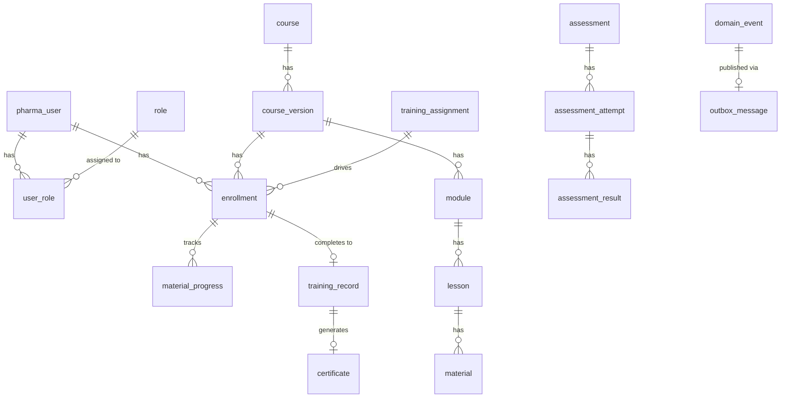

---

## 3. Kafka & event bus

### 3.1 Architecture

- **Event flow:** Domain actions write to **PostgreSQL** (e.g. audit_trail, domain_event). A **transactional outbox** is used: outbox messages are written in the same transaction. A **scheduled job** (KafkaEventProcessor.processOutbox) reads the outbox and, when **KAFKA_REST_URL** is set, **publishes to Kafka** via Confluent Kafka REST Proxy. When Kafka is not configured, events remain in the outbox only (no-op publish).
- **DomainEvent** table stores: eventType, aggregateId, payloadJson, createdAt, processedAt, **kafkaOffset** (set when published).
- **KafkaEventProcessor** (FutureCall): `processSopUpdated`, `processEmployeeCreated`, `processEmployeeTransferred`, `processOutbox`.

### 3.2 Kafka topics (from KafkaProducer)

- pharma.training.enrollment  
- pharma.training.assessment  
- pharma.training.assignment  
- pharma.training.certificate  
- pharma.training.progress  
- pharma.sop.updated  
- pharma.quality.capa  
- pharma.analytics.compliance  
- pharma.course.lifecycle  

### 3.3 Event flow (Mermaid)

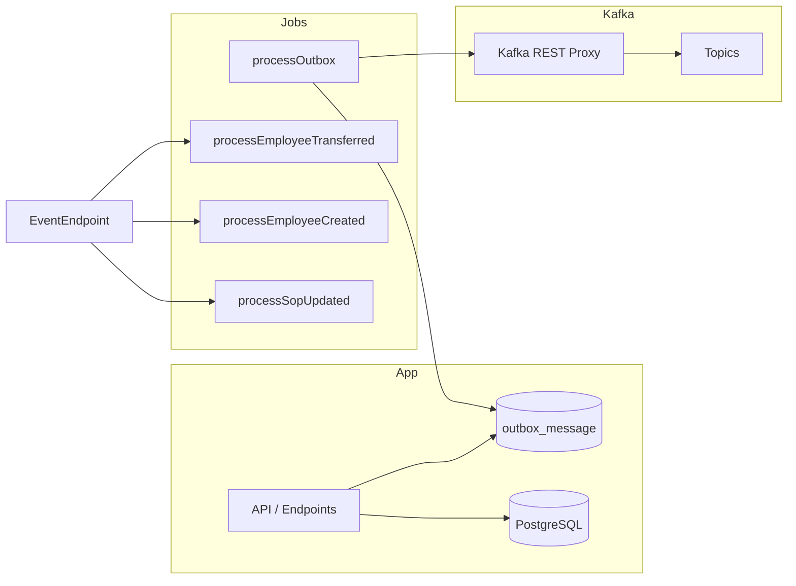

### 3.4 Configuration

- **Kafka (optional):** Set `KAFKA_REST_URL` (e.g. `http://localhost:8082`). If unset, no messages are sent to Kafka; outbox still fills.
- **Health:** Admin health dashboard can show `kafkaConsumerLag` (from analytics endpoint); when Kafka is disabled it returns 0.

---

## 4. Design schema (protocol / API)

The **design schema** is the Serverpod protocol: YAML definitions under `pharma_lms_server/lib/src/protocol/`, generated Dart in `pharma_lms_server/lib/src/generated/` and `pharma_lms_client/lib/src/protocol/`. Tables map 1:1 to persisted protocol classes (see [DATABASE_SCHEMA_README.md](./DATABASE_SCHEMA_README.md)).

### 4.1 Protocol domains (high-level)

| Domain | Purpose | Key types (examples) |
|--------|---------|------------------------|
| Admin | Bulk import, logs | ImportLog, BulkImportResult |
| Analytics | Dashboards, SLA, reports | AnalyticsSnapshot, Dashboard, DepartmentComplianceSnapshot, ReportDefinition, SlaBreach, SlaPolicy |
| Assessment | Tests, attempts, results | Assessment, AssessmentAttempt, AssessmentResult, QuestionBank, Question |
| Audit | Trail, access log, report export | AuditTrail, AccessLog, ReportExport |
| Auth | Session (Serverpod) | — |
| Course | Courses, versions, modules, lessons | Course, CourseVersion, Module, Lesson |
| Document | SOPs, documents | Document |
| Events | Domain events, outbox | DomainEvent, OutboxMessage |
| Material | Content, versions, progress | Material, MaterialVersion, MaterialProgress |
| MFA | User MFA, verified session | UserMfa, MfaVerifiedSession |
| Notifications | In-app notifications | Notification |
| Organization | Users, roles, departments | PharmaUser, UserRole, Role, Department, UserPreference |
| Quality | CAPA, etc. | Capa |
| Training | Enrollments, assignments, records, certs, waivers, e-signature | Enrollment, TrainingAssignment, TrainingRecord, Certificate, SignatureMeaning, TrainingWaiver, ElectronicSignature |

### 4.2 API surface (endpoints used by employee portal)

- **user:** getUser, getUserByEmail, getUserRoleByEmail, getUserPreferences  
- **training:** listSignatureMeanings, getAssignmentsForUser, getEnrollmentsForUser, getEnrollmentById, getCertificatesForUser, getTrainingRecordsForUser, getEnrollmentProgress, selfEnroll, updateProgress, recordEngagement, completeTraining, createTrainingSignature, getWaiverById, getEnrollmentResumePosition  
- **course:** listCourses, getCourseVersion, getCourseVersions, getModulesForCourseVersion, getLessonsForModule, getLessonById  
- **material:** getLessonWithMaterial, getProgress, updateProgress, recordEngagement, getMaterialViewUrl  
- **assessment:** getAssessmentForCourse, getQuestions, getAttemptCount, startAttempt, recordAnswer, submitAttempt  
- **compliance:** getUserCompliance, getDepartmentCompliance  
- **analytics:** getDashboardSummary, etc.  
- **notification:** getInAppNotifications, markNotificationRead  
- **mfa:** getMfaStatus, enrollMfa, verifyMfaEnrollment, verifyMfa, disableMfa  
- **audit:** logReportExport  
- **auth:** signIn, signOut (Serverpod auth)

---

## 5. Mermaid diagrams by screen

Below: **one diagram per employee-portal screen** (flow: user action → data/API → navigation). Routes from `app_router.dart` (EmployeeShellV2).

### 5.1 Login

```mermaid
flowchart TD
    A[Login Screen] --> B{Submit credentials}
    B --> C[Auth / getUserRoleByEmail]
    C --> D[pharma_user, user_role, role]
    C --> E[MFA?]
    E -->|Yes| F[getMfaStatus / verifyMfa]
    E -->|No| G[Redirect by role]
    F --> G
    G --> H[/employee]
    G --> I[/trainer]
    G --> J[/admin]
```

### 5.2 Employee shell (layout)

```mermaid
flowchart LR
    A[EmployeeShellV2] --> B[Sidebar nav]
    A --> C[Header: notifications, profile]
    B --> D[/employee]
    B --> E[/employee/my-training]
    B --> F[/employee/catalog]
    B --> G[/employee/assessments]
    B --> H[/employee/training-history]
    B --> I[/employee/credentials]
    B --> J[/employee/profile]
    C --> K[getInAppNotifications]
    C --> L[markNotificationRead]
    C --> M[getUserByEmail]
```

### 5.3 Employee dashboard

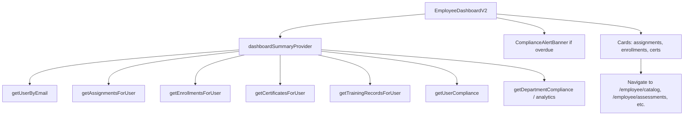

### 5.4 My Training

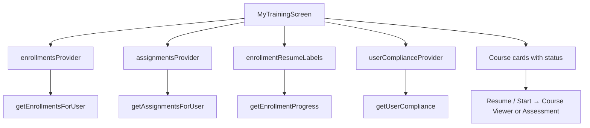

### 5.5 Course catalog

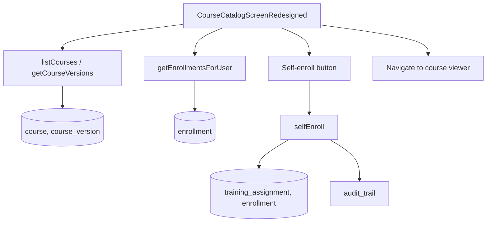

### 5.6 Course viewer

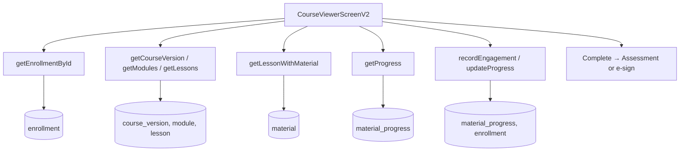

### 5.7 Assessments list

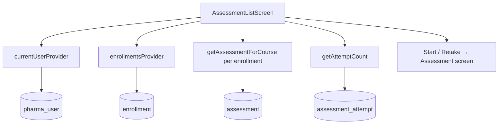

### 5.8 Assessment (take)

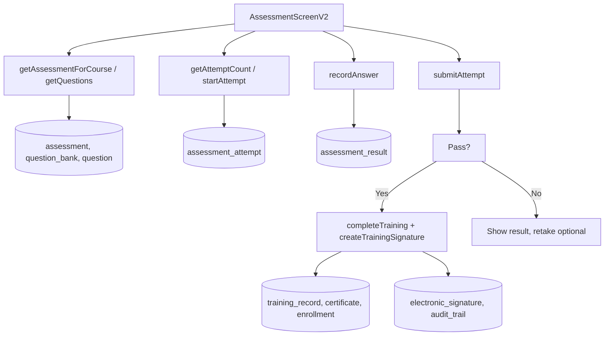

### 5.9 Training history

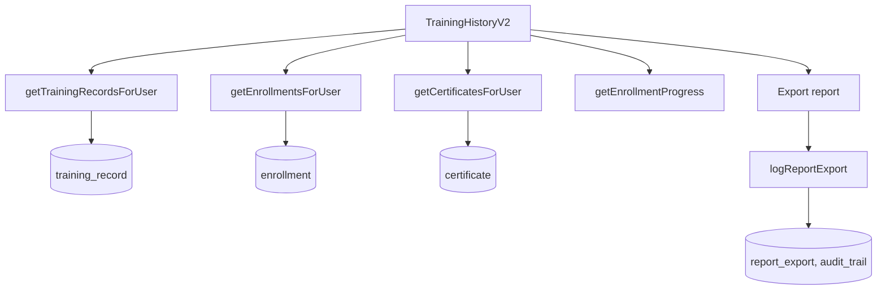

### 5.10 Credentials

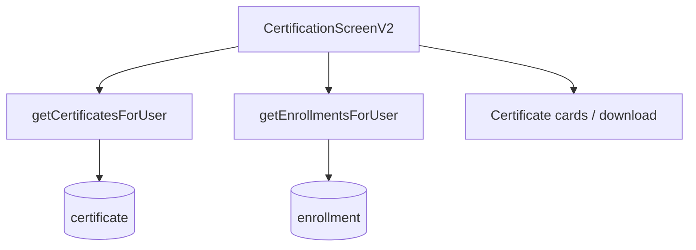

### 5.11 Profile

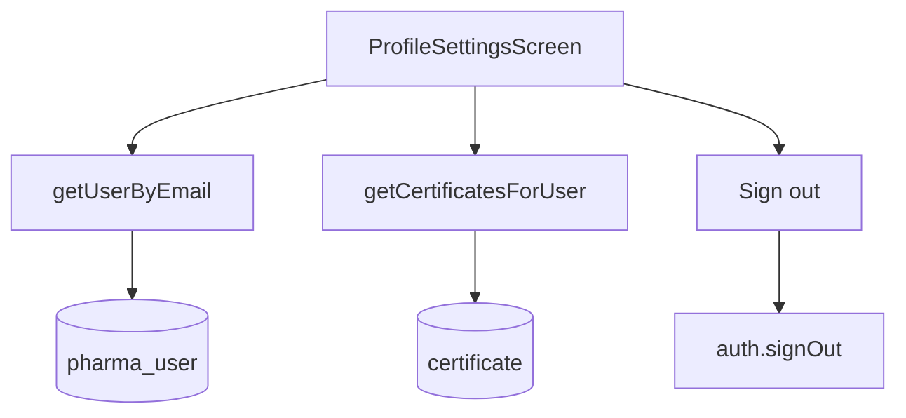

### 5.12 MFA enrollment

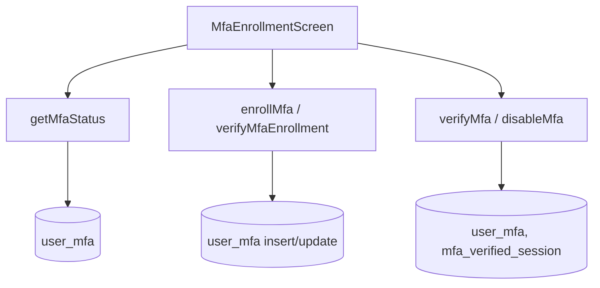

### 5.13 Waiver

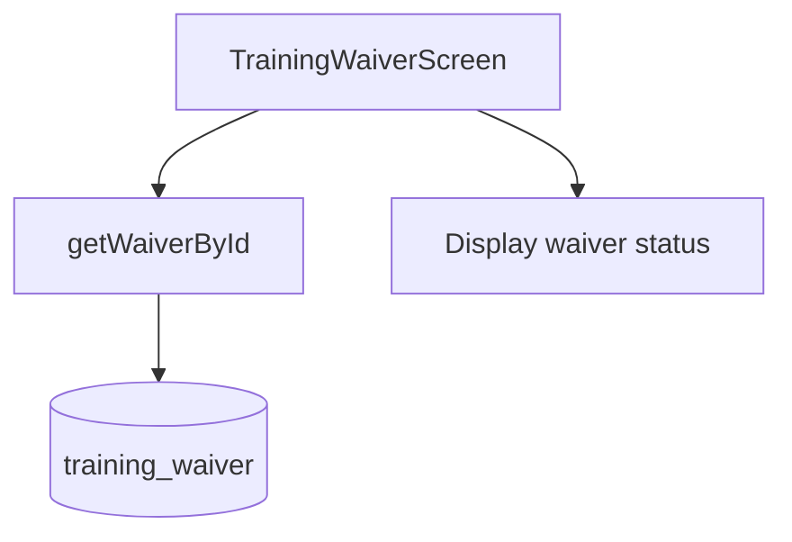

### 5.14 Lessons

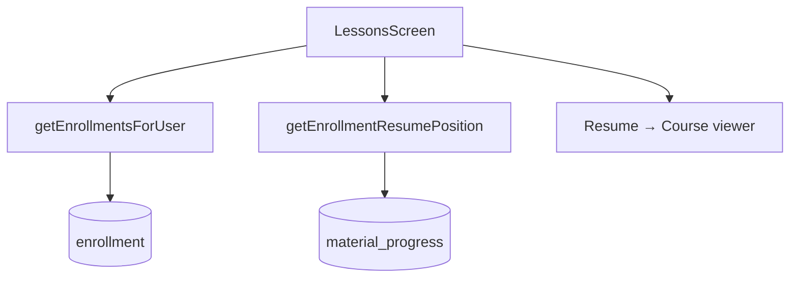

### 5.15 Downloads

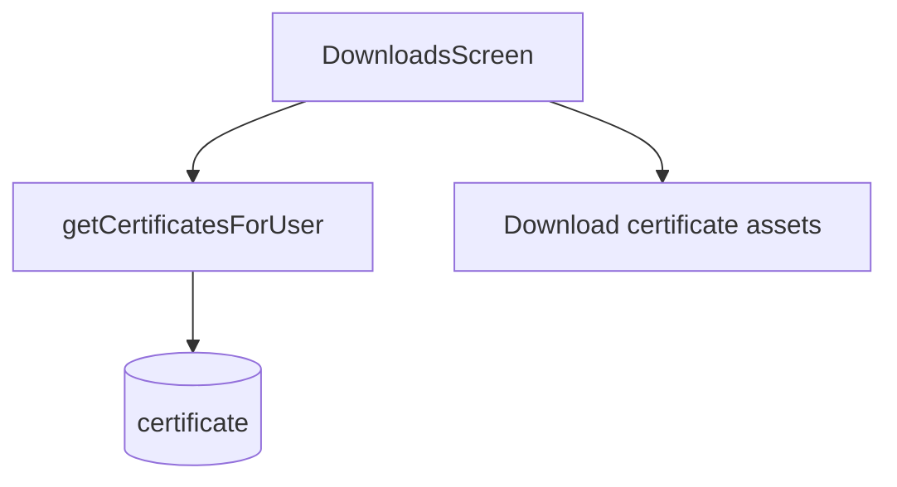

### 5.16 High-level app flow (all portals)

```mermaid
flowchart TB
    Login[/] --> Role{Role?}
    Role -->|employee| Emp[/employee]
    Role -->|trainer| Trn[/trainer]
    Role -->|admin| Adm[/admin]
    Role -->|qa_manager| QA[/qa]
    Emp --> ED[Dashboard]
    Emp --> MT[My Training]
    Emp --> CC[Course Catalog]
    Emp --> CV[Course Viewer]
    Emp --> AL[Assessments List]
    Emp --> AS[Assessment Take]
    Emp --> TH[Training History]
    Emp --> CR[Credentials]
    Emp --> PR[Profile]
    CV --> AS
    MT --> CV
    CC --> CV
```

---

## Related docs

| Document | Description |
|----------|-------------|
| [DATABASE_SCHEMA_README.md](./DATABASE_SCHEMA_README.md) | Every protocol class, table, and field |
| [EMPLOYEE_PORTAL_DATABASE_ACCESS.md](./EMPLOYEE_PORTAL_DATABASE_ACCESS.md) | Per-screen read/write tables for employee portal |
| [DEPLOYMENT.md](./DEPLOYMENT.md) | Deployment and environment |
| [LOCAL_DEVELOPMENT_SETUP.md](./LOCAL_DEVELOPMENT_SETUP.md) | Local setup (PostgreSQL, Redis, optional Kafka) |
