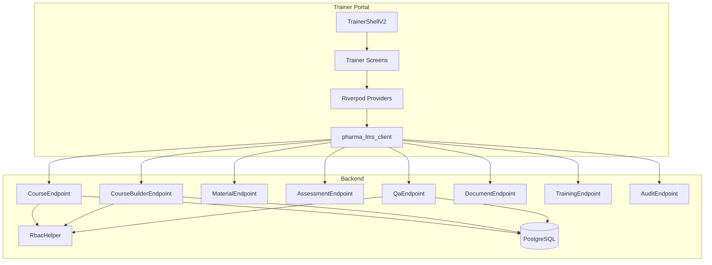
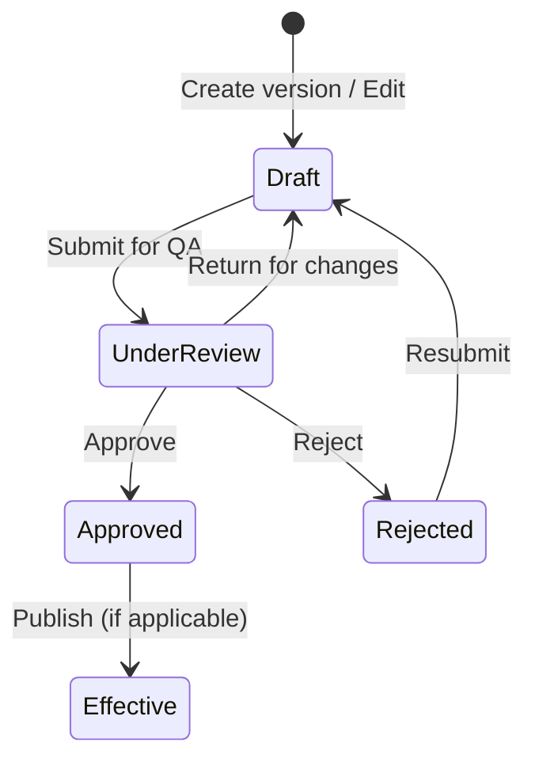
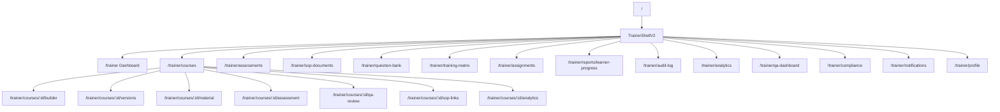

# Trainer Portal — System Design

This document describes the **system design** behind the **entire trainer portal**: architecture, layers, data flow, design principles, security, and performance. Trainer screens (TRN-01 through TRN-17) are used by trainers and SMEs to create and manage courses, assignments, QA, and compliance.

---

## Table of contents

1. [Purpose & scope](#1-purpose--scope)
2. [Architecture overview](#2-architecture-overview)
3. [Technology stack](#3-technology-stack)
4. [Layers & components](#4-layers--components)
5. [State management & data flow](#5-state-management--data-flow)
6. [Design principles](#6-design-principles)
7. [Security & compliance](#7-security--compliance)
8. [Performance & reliability](#8-performance--reliability)
9. [Diagrams](#9-diagrams)
10. [Related documentation](#10-related-documentation)

---

## 1. Purpose & scope

The **trainer portal** is the authoring and management side of Pharma LMS for **trainers** and **SMEs**. It allows them to:

- **Dashboard (TRN-09):** View own courses, stats, courses requiring action, recent activity, quick actions.
- **Course list (TRN-10):** List/create/delete courses; navigate to builder, versions, material, assessment, QA, analytics, SOP links.
- **Course builder (TRN-01):** Create/edit modules and lessons; attach materials; validate; submit for QA.
- **Course versions (TRN-05):** Create new version, view version history, QA status.
- **Material upload (TRN-02):** Upload and manage materials for a course version.
- **Assessment builder (TRN-03):** Build assessments and link to course; use question banks.
- **QA review (TRN-04):** Submit for QA; QA role can approve, return for changes, or reject.
- **SOP linkage (TRN-06):** Link courses to SOP documents.
- **Course analytics (TRN-08):** View pass rates, attempts, score distribution per course version.
- **Training matrix (TRN-13):** Manage role/department → course mappings.
- **Training assignments (TRN-14):** Assign training to users/groups.
- **Learner progress (TRN-15):** View enrollments and certificates per learner.
- **Audit log (TRN-16):** View and export audit trail.
- **SOP document library (TRN-11):** List and manage SOP documents.
- **Question bank library (TRN-12):** Create/edit question banks and questions.
- **AI question generation:** Generate questions with human review gate.
- **Analytics overview, QA dashboard, Compliance, Notifications, Profile (TRN-17).**

**Out of scope:** Employee portal, admin portal, QA-only flows outside trainer shell, auditor portal.

---

## 2. Architecture overview

The trainer portal is a **Flutter client** using the same **Serverpod backend** and **PostgreSQL** as the rest of the app. It uses a **separate shell** (TrainerShellV2) and **trainer-specific endpoints** (course builder, QA, assessment builder, document, etc.). Role is determined at login (`trainer` / `sme`); router redirects to `/trainer`.

```
┌─────────────────────────────────────────────────────────────────────────┐
│                        TRAINER PORTAL (Flutter)                         │
│  ┌─────────────────┐  ┌─────────────────┐  ┌─────────────────────────┐ │
│  │ TrainerShellV2  │  │ Routes / Screens │  │ Riverpod (state/cache)   │ │
│  │ (layout, nav)   │  │ /trainer/*      │  │ trainerCoursesProvider   │ │
│  └────────┬────────┘  └────────┬────────┘  │ allOrgCoursesProvider    │ │
│           │                    │           │ + screen-local providers │ │
│           └────────────────────┴───────────┴────────────┬─────────────┘ │
│                                                         │               │
│                        pharma_lms_client                │               │
│                        course, courseBuilder, material, assessment,     │
│                        assessmentBuilder, qa, document, training,       │
│                        analytics, audit, auditTrail                     │
└─────────────────────────────────────────────────────────┴───────────────┘
                                                          │
                                    HTTPS / Serverpod RPC  │
                                                          ▼
┌─────────────────────────────────────────────────────────────────────────┐
│                        SERVERPOD BACKEND                                │
│  CourseEndpoint, CourseBuilderEndpoint, MaterialEndpoint,                │
│  AssessmentEndpoint, AssessmentBuilderEndpoint (or equivalent),          │
│  QaEndpoint, DocumentEndpoint, TrainingEndpoint, AnalyticsEndpoint,     │
│  AuditEndpoint, AuditTrailEndpoint                                       │
│  → RbacHelper (trainer/sme permissions: training, course, qa, etc.)     │
│  → PostgreSQL (course, course_version, module, lesson, material,        │
│                assessment, question_bank, document, audit_trail, ...)     │
└─────────────────────────────────────────────────────────────────────────┘
```

---

## 3. Technology stack

| Layer | Technology |
|-------|------------|
| **UI** | Flutter (Dart), Material 3, go_router |
| **State** | Riverpod (FutureProvider, StateProvider, ref.watch/read); screen-local async state |
| **API** | Serverpod RPC (pharma_lms_client) |
| **Backend** | Serverpod (Dart), PostgreSQL |
| **Auth** | Serverpod auth; role `trainer` or `sme` for trainer portal |
| **Design** | Pharma design system (PharmaColors, PharmaSpacing, PharmaTypography, PharmaShadows, etc.) |

---

## 4. Layers & components

### 4.1 Presentation layer

- **Shell:** `TrainerShellV2` — sidebar (desktop) or drawer/bottom nav (mobile), header (search, pending QA badge, avatar). 15‑min idle timeout with overlay (“Continue Session” / “Log Out Now”). Same design language as employee shell but nav items and labels for trainer (Dashboard, Courses, Materials, Assessments, SOP Documents, Question Bank, Training Matrix, Assignments, Reports, Audit Log, Analytics, QA Dashboard, Compliance, Notifications, Profile).
- **Screens:** One or more widgets per route under `/trainer` (see route table below). Builder screens (course builder, assessment builder) use dual-panel or stepped flows where appropriate; QA review shows workflow state (DRAFT → UNDER REVIEW → QA APPROVED).
- **Design system:** Same tokens and components as the rest of the app (pharma_design_system.dart, pharma_components.dart).

### 4.2 Trainer routes (summary)

| Route | Screen | Purpose |
|-------|--------|---------|
| `/trainer` | TrainerDashboardV2 | TRN-09 Dashboard |
| `/trainer/courses` | CourseListScreen | TRN-10 Course list |
| `/trainer/courses/:courseId/builder` | CourseBuilderV2Screen | TRN-01 Course builder |
| `/trainer/courses/:courseId/versions` | CourseVersionsScreen | TRN-05 Versions |
| `/trainer/courses/:courseId/material` | MaterialUploadV2Screen | TRN-02 Material |
| `/trainer/courses/:courseId/assessment` | AssessmentBuilderV2Screen | TRN-03 Assessment |
| `/trainer/courses/:courseId/qa-review` | QAReviewScreen | TRN-04 QA review |
| `/trainer/courses/:courseId/sop-links` | SopLinkageScreen | TRN-06 SOP linkage |
| `/trainer/courses/:courseId/analytics` | CourseAnalyticsV2Screen | TRN-08 Analytics |
| `/trainer/assessments` | AssessmentBuilderV2Screen(courseId: 0) | Assessment builder |
| `/trainer/assessments/ai-generate` | AiQuestionGenerationScreen | AI questions |
| `/trainer/sop-documents` | SopDocumentLibraryScreen | TRN-11 SOP library |
| `/trainer/question-bank` | QuestionBankLibraryScreen | TRN-12 Question banks |
| `/trainer/training-matrix` | TrainingMatrixScreen | TRN-13 Matrix |
| `/trainer/assignments` | TrainingAssignmentsScreen | TRN-14 Assignments |
| `/trainer/reports/learner-progress` | LearnerProgressScreen | TRN-15 Learner progress |
| `/trainer/audit-log` | AuditLogViewerScreen | TRN-16 Audit log |
| `/trainer/analytics` | AnalyticsOverviewScreen | Analytics overview |
| `/trainer/qa-dashboard` | TrainerQADashboardScreen | QA dashboard |
| `/trainer/compliance` | TrainerComplianceScreen | Compliance |
| `/trainer/notifications` | NotificationCentreScreen | Notifications |
| `/trainer/profile` | TrainerProfileScreen | TRN-17 Profile |

### 4.3 Application / state layer

- **Trainer-scoped providers:** e.g. `trainerCoursesProvider` (courses created by current user), `allOrgCoursesProvider` (all org courses), `_trainerAuditProvider`, `_trainerAvgPassRateProvider`. Many screens also create local `FutureProvider` or use async state (e.g. load course + versions + modules in course builder).
- **No single “dashboard summary” like employee:** Trainer dashboard composes trainer courses + audit + pass rate; other screens load their own data (course, versions, modules, lessons, assessments, QA status, etc.).

### 4.4 API / client layer

- **Endpoints used by trainer portal:**  
  `course` (listCourses, getCourse, getCourseVersions, getCourseVersion, getModulesForCourseVersion, getLessonsForModule, deleteCourse),  
  `courseBuilder` (createCourseVersion, createModule, createLesson, updateModule, updateLesson, deleteModule, deleteLesson, validateForQaSubmission, submitForQaReview),  
  `material` (createMaterial, getMaterial, list materials, etc.),  
  `assessment` (getAssessmentForCourse, getQuestions, listQuestionBanks),  
  `assessmentBuilder` (createQuestionBank, createQuestion, updateQuestion, deleteQuestion, link assessment to course, etc.),  
  `qa` (getCourseReviews, approveCourseVersion, returnCourseForChanges, rejectCourseVersion, listPendingCourseVersions),  
  `document` (listDocuments, getDocumentVersions),  
  `training` (assignTraining, getEnrollmentsForUser, getCertificatesForUser, getEnrollmentsForCourseVersion, etc.),  
  `analytics` (getCourseAnalytics, etc.),  
  `audit` (getAuditTrail, exportAuditCsv),  
  `auditTrail` (logAction for builder events).  
- **SOP linkage / training matrix:** Endpoints for linking courses to SOPs and managing matrix (e.g. role/department → course).

### 4.5 Backend layer

- **RBAC:** Trainer/sme role has permissions on resources such as `course` (create, read, update), `training` (read, assign), `qa` (read; approve/return/reject for QA role). Endpoints enforce these before DB access.
- **Workflow:** Course version status (draft → submitted for QA → approved / returned / rejected). QA endpoints transition state and write audit.
- **Database:** Same PostgreSQL schema; trainer writes to course, course_version, module, lesson, material, assessment, question_bank, question, document, training_assignment, audit_trail, etc. See [DATABASE_SCHEMA_README.md](./DATABASE_SCHEMA_README.md).

---

## 5. State management & data flow

### 5.1 Read path

1. Screen or provider calls e.g. `client.course.getCourse(courseId)`, `client.course.getCourseVersions(courseId)`, `client.course.getModulesForCourseVersion(versionId)`, `client.qa.getCourseReviews(courseVersionId)`.
2. Server runs endpoint (RBAC, DB read), returns protocol objects.
3. UI caches in Riverpod or local state and renders (e.g. tree of modules/lessons, QA status).

### 5.2 Write path

1. User action (e.g. Create module, Submit for QA, Approve course, Assign training).
2. Handler calls e.g. `client.courseBuilder.createModule(...)`, `client.courseBuilder.submitForQaReview(...)`, `client.qa.approveCourseVersion(...)`, `client.training.assignTraining(...)`.
3. Server performs insert/update and audit (e.g. AuditTrail.logAction for builder events); returns result or throws.
4. UI invalidates relevant providers or reloads data and shows feedback.

### 5.3 Navigation

- **go_router:** Routes under `ShellRoute(TrainerShellV2)`; `context.go('/trainer/...')` or `context.push(...)` with path params (e.g. courseId). Role redirect: trainer/sme → `/trainer`.

---

## 6. Design principles

(The following are taken from or aligned with the TrainerShellV2 and trainer feature set.)

| Principle | Application |
|-----------|-------------|
| **Content integrity over speed** | Auto-save where appropriate plus explicit Save/Submit; avoid losing work. |
| **Workflow state visible** | DRAFT → UNDER REVIEW → QA APPROVED (and returned/rejected) shown in QA review and version screens. |
| **Dual-panel on builder screens** | Course builder: outline (modules/lessons) + detail (selected lesson/material); assessment builder: question list + edit. |
| **Preview as employee** | Ability to open course/viewer as learner would (e.g. link to employee course viewer) for validation. |
| **Compliance-first data capture** | Audit trail for builder actions (e.g. ModuleAdded, LessonAdded); report export audit; e-signature where required. |
| **AI with human review gate** | AI question generation (TRN) requires review before use in assessments. |
| **Role-appropriate actions** | Trainer: create/edit, submit for QA. QA role: approve, return, reject. Assignments: trainer or admin. |
| **Progressive complexity** | Course list → builder → versions → material/assessment/QA/analytics; clear entry points and breadcrumbs. |

---

## 7. Security & compliance

- **Authentication:** Same Serverpod session as rest of app; role `trainer` or `sme` (and optionally `qa_manager` for QA actions) required for trainer portal.
- **Authorization:** Backend checks resource/action (e.g. `course` create/read/update, `qa` approve). Trainer sees only own org’s courses (or scoped by createdById); QA sees pending/reviewable versions.
- **Audit:** Builder actions (module/lesson add/update/delete) and QA transitions (approve, return, reject) write to audit_trail; report exports (e.g. audit log export) call logReportExport where applicable.
- **Data in transit:** HTTPS. No direct DB or Kafka from client.

---

## 8. Performance & reliability

- **Dashboard:** Fetches trainer’s courses and optional audit/pass rate; can be tuned with limits/cache.
- **Builder screens:** Load course + versions + modules + lessons (and materials) as needed; validation and submit are explicit calls. Large trees may be paginated or lazy-loaded where implemented.
- **Error handling:** Async UI (loading/error states); Retry or re-navigate; server errors surface via SnackBar or error widget.
- **No direct DB:** All writes through Serverpod; consistency and audit on the server.

---

## 9. Diagrams

### 9.1 Trainer portal architecture



### 9.2 Trainer workflow (course lifecycle)



### 9.3 Trainer portal screen map



---

## 10. Related documentation

| Document | Description |
|----------|-------------|
| [EMPLOYEE_PORTAL_README.md](./EMPLOYEE_PORTAL_README.md) | Employee portal classes, methods, buttons, read/write |
| [EMPLOYEE_PORTAL_SYSTEM_DESIGN.md](./EMPLOYEE_PORTAL_SYSTEM_DESIGN.md) | Employee portal system design |
| [EMPLOYEE_PORTAL_DATABASE_ACCESS.md](./EMPLOYEE_PORTAL_DATABASE_ACCESS.md) | Tables read/written per employee screen |
| [DATABASE_SCHEMA_README.md](./DATABASE_SCHEMA_README.md) | Full schema (tables, protocol classes, fields) |
| [PROJECT_ARCHITECTURE_AND_DESIGN.md](./PROJECT_ARCHITECTURE_AND_DESIGN.md) | App-wide design system, DB, Kafka, Mermaid |
